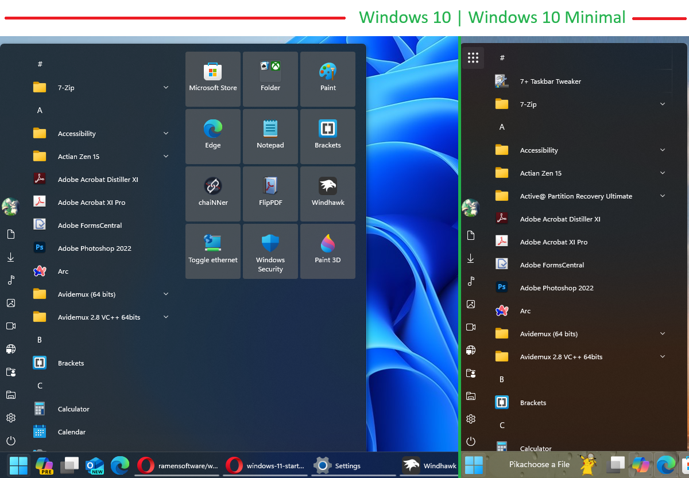

# Windows10 theme for Windows 11 Start Menu Styler

**Author**: [BBmaster123](https://github.com/bbmaster123)



## Notes:

* Please enable all nav buttons on the left in settings. If you use fewer, the new sign out menu will be further to the right than intended.
* For a centered Start menu, please set the following additional styles:
  * Target: `StartDocked.StartSizingFrame` \
    Style: `Margin=-14,24,0,0`
  * Target: `Windows.UI.Xaml.Controls.ContentDialog > Border > Grid > Border` \
    Style: `Margin=[1/2 screen width],0,0,0`

## Theme selection

The theme is integrated into the mod and can be selected directly from the mod's
settings:

* Open the Windows 11 Start Menu Styler mod in Windhawk.
* Go to the "Settings" tab.
* Select the theme and save the settings.

## Manual installation

The theme styles can also be imported manually. To do that, follow these steps:

* Open the Windows 11 Start Menu Styler mod in Windhawk.
* Go to the "Settings" tab and select "Textual mode".
* Copy the content below to the text box and click "Save settings".

## Standard Variant

### Redesigned Start menu

A variant for the [redesigned Windows 11 Start
menu](https://microsoft.design/articles/start-fresh-redesigning-windows-start-menu/)
that is slowly rolling out in the 25H2 update.

<details>
<summary>Content to import (click to expand)</summary>

```yaml
controlStyles:
  - target: Grid
    styles:
      - RequestedTheme=2
  - target: Grid#FrameRoot
    styles:
      - Height=750
      - Margin=-16,0,0,-14
  - target: Windows.UI.Xaml.Controls.Border#AcrylicBorder
    styles:
      - BorderThickness=0
      - CornerRadius=0,8,0,0
  - target: StartDocked.AppListViewItem > Grid > Border#BackgroundBorder
    styles:
      - CornerRadius=0
      - BorderThickness=0,1,1,0
      - BorderBrush:=<RevealBorderBrush Color="Transparent" TargetTheme="1" Opacity="1"/>
  - target: Windows.UI.Xaml.Controls.Border#Border@CommonStates
    styles:
      - CornerRadius=0
      - BorderBrush@PointerOver:=<RevealBorderBrush Color="Transparent" TargetTheme="1" Opacity="0.5"/>
  - target: Grid#ContentBorder@CommonStates
    styles:
      - Background@PointerOver:=<RevealBorderBrush Color="Transparent" TargetTheme="1" Opacity="1"/>
      - Background:=<RevealBorderBrush Color="Transparent" TargetTheme="1" Opacity="0"/>
  - target: StartDocked.NavigationPaneView
    styles:
      - Transform3D:=<CompositeTransform3D RotationZ="270" />
      - Width=740
      - VerticalAlignment=0
      - Margin=-11,-549,0,0
  - target: StartDocked.AppListView#NavigationPanePlacesListView
    styles:
      - HorizontalAlignment=2
      - Margin=0,0,200,0
  - target: StartDocked.UserTileView
    styles:
      - HorizontalAlignment=2
      - Margin=0,-2,35,0
      - Transform3D:=<CompositeTransform3D TranslateX="50" />
      - Height=42
  - target: Windows.UI.Xaml.Controls.TextBlock#UserTileNameText
    styles:
      - Visibility=Collapsed
  - target: StartDocked.NavigationPaneButton > Grid@CommonStates > Windows.UI.Xaml.Controls.ContentPresenter > Grid > Grid#UserTileIcon
    styles:
      - Margin=-3,0,-3,-62
      - Transform3D:=<CompositeTransform3D RotationZ="90" />
      - Width=30
      - Height=30
  - target: StartDocked.AppListViewItem > Grid > ContentPresenter
    styles:
      - Transform3D:=<CompositeTransform3D RotationZ="90" />
      - Margin=0,40,0,-40
  - target: StartDocked.PowerOptionsView
    styles:
      - Transform3D:=<CompositeTransform3D TranslateY="-600" TranslateX="465" RotationZ="90" />
      - Margin=-669,640,670,-640
  - target: Windows.UI.Xaml.Controls.TextBlock#PinnedListHeaderText
    styles:
      - Visibility=Collapsed
  - target: Windows.UI.Xaml.Controls.GridView#PinnedList > Border > Windows.UI.Xaml.Controls.ScrollViewer > Border > Grid > Windows.UI.Xaml.Controls.ScrollContentPresenter > Windows.UI.Xaml.Controls.ItemsPresenter > Windows.UI.Xaml.Controls.ItemsWrapGrid > Windows.UI.Xaml.Controls.GridViewItem > Border#ContentBorder@CommonStates > Grid#DroppedFlickerWorkaroundWrapper > Border
    styles:
      - CornerRadius=4
      - Background:=<SolidColorBrush Color="#24B4B4B4" />
      - Margin=2
      - Background:=<SolidColorBrush Color="{ThemeResource SystemBaseMediumColor}" Opacity="0.2"/>
  - target: StartMenu.PinnedList#StartMenuPinnedList
    styles:
      - MaxWidth=700
      - RenderTransform:=<TranslateTransform X="345" Y="880" />
      - Height=674
  - target: Windows.UI.Xaml.Controls.Primitives.ScrollBar
    styles:
      - Margin=0,-15,17,15
      - Height=700
  - target: MenuFlyoutSeparator
    styles:
      - Margin=0,-2,0,-2
      - Padding=4
  - target: MenuFlyoutItem
    styles:
      - Margin=2,0,0,2
  - target: MenuFlyoutPresenter
    styles:
      - BorderBrush:=<RevealBorderBrush Color="Transparent" TargetTheme="1" Opacity="1"/>
  - target: MenuFlyoutPresenter > Border > ScrollViewer
    styles:
      - CornerRadius=8
      - Padding=-3,0,-1,0
  - target: Grid#TopLevelSuggestionsListHeader
    styles:
      - Visibility=Collapsed
  - target: StartMenu.FolderModal
    styles:
      - RenderTransform:=<TranslateTransform X="150" />
  - target: StartMenu.FolderModal > Grid > Border
    styles:
      - Width=350
      - BorderBrush:=<RevealBorderBrush Color="Transparent" TargetTheme="1" Opacity="1"/>
      - BorderThickness=1
  - target: Border#UninstallFlyoutPresenterBorder
    styles:
      - BorderBrush:=<RevealBorderBrush Color="Transparent" TargetTheme="1" Opacity="0.8"/>
  - target: Windows.UI.Xaml.Controls.ContentDialog
    styles:
      - BorderBrush:=<RevealBorderBrush Color="Transparent" TargetTheme="1" Opacity="0.8"/>
  - target: Button#Header > Border#Border@CommonStates
    styles:
      - BorderThickness=1
      - Background@PointerOver:=<RevealBorderBrush Color="Transparent" TargetTheme="1" Opacity="0.5"/>
      - Background@Pressed:=<RevealBorderBrush Color="Transparent" TargetTheme="1" Opacity="0.5"/>
      - Background:=<RevealBorderBrush Color="Transparent" TargetTheme="1" Opacity="0"/>
  - target: TextBlock#Text
    styles:
      - FontSize=16
      - HorizontalAlignment=3
      - VerticalAlignment=2
      - Height=64
      - Padding=5,40,0,0
  - target: StartDocked.NavigationPaneButton#UserTileButton > Grid@CommonStates > Border
    styles:
      - BorderBrush:=<RevealBorderBrush Color="Transparent" TargetTheme="1" Opacity="1"/>
      - CornerRadius=5,0,0,0
      - Margin=1,1,1.5,1.5
      - BorderThickness=1,2,1,0
      - Background@Pressed:=<RevealBorderBrush Color="Transparent" TargetTheme="1" Opacity="1"/>
      - Background:=<RevealBorderBrush Color="Transparent" TargetTheme="1" Opacity="0"/>
  - target: StartDocked.NavigationPaneButton#PowerButton > Grid@CommonStates
    styles:
      - BorderThickness=0,0,1,1
      - Margin=0.5,2.5,0.5,0
      - Background@PointerOver:=<RevealBorderBrush Color="Transparent" TargetTheme="1" Opacity="0.8"/>
      - BorderBrush@PointerOver:=<RevealBorderBrush Color="#22FFFFFF" TargetTheme="1" Opacity="1"/>
      - CornerRadius=0
      - BorderBrush:=<RevealBorderBrush Color="Transparent" TargetTheme="1" Opacity="0.8"/>
  - target: Border#ContentBorder@CommonStates > Grid > Border#HighContrastBorder
    styles:
      - Background@PointerOver:=<RevealBorderBrush Color="Transparent" TargetTheme="1" Opacity="0.5"/>
      - BorderBrush@PointerOver:=<RevealBorderBrush Color="Transparent" TargetTheme="1" Opacity="1"/>
      - Background@Pressed:=<RevealBorderBrush Color="Transparent" TargetTheme="1" Opacity="0.64"/>
      - BorderBrush@Pressed:=<RevealBorderBrush Color="#22FFFFFF" TargetTheme="1" Opacity="1"/>
      - Background:=<RevealBorderBrush Color="Transparent" TargetTheme="1" Opacity="0"/>
  - target: Cortana.UI.Views.TaskbarSearchPage > Grid > Grid
    styles:
      - Width=880
      - Height=886
      - Margin=-60,-10,0,-28
  - target: Border#AppBorder
    styles:
      - BorderBrush:=<RevealBorderBrush Color="Transparent" TargetTheme="1" Opacity="1"/>
      - Width=750
      - BorderThickness=2
  - target: Grid#QueryFormulationRoot
    styles:
      - Padding=-14,8,-14,0
      - Width=720
  - target: Border#TaskbarSearchBackground
    styles:
      - BorderBrush=#88FFFFFF
      - Background:=<RevealBorderBrush Color="Transparent" TargetTheme="1" Opacity="1"/>
      - BorderThickness=1
  - target: FlyoutPresenter
    styles:
      - Margin=10,20,140,0
  - target: FlyoutPresenter > Border
    styles:
      - BorderBrush:=<RevealBorderBrush Color="Transparent" TargetTheme="1" Opacity="0.8"/>
      - BorderThickness=1
      - CornerRadius=8
  - target: Windows.UI.Xaml.Controls.ContentDialog > Border > Grid > Border
    styles:
      - BorderBrush:=<RevealBorderBrush Color="Transparent" TargetTheme="1" Opacity="1"/>
  - target: Grid#MainContent
    styles:
      - Margin=0,-63,1,-63
  - target: Grid#TopLevelHeader > Grid[2]
    styles:
      - Visibility=Collapsed
  - target: Windows.UI.Xaml.Controls.GridView#AllAppsGrid
    styles:
      - Margin=10,0,-10,0
  - target: Grid#MainMenu
    styles:
      - Width=720
  - target: Border#StartDropShadow
    styles:
      - Margin=0,0,2,0
  - target: Windows.UI.Xaml.Controls.ItemsWrapGrid
    styles:
      - MaxWidth=333
  - target: StartMenu.StartHome
    styles:
      - Margin=-280,1,0,0
  - target: StartMenu.SearchBoxToggleButton
    styles:
      - Visibility=Collapsed
  - target: Windows.UI.Xaml.Controls.Primitives.ToggleButton
    styles:
      - Visibility=Visible
      - Margin=-653,92,653-92
  - target: Microsoft.UI.Xaml.Controls.DropDownButton > Grid > Windows.UI.Xaml.Controls.ContentPresenter > TextBlock
    styles:
      - Text=
      - FontFamily=Segoe Fluent Icons
      - FontSize=16
      - Margin=-8
  - target: Grid#TopLevelHeader > Grid > Grid
    styles:
      - Visibility=Collapsed
  - target: Windows.UI.Xaml.Controls.GridView > Border > ScrollViewer
    styles:
      - ScrollViewer.VerticalScrollMode=2
  - target: Microsoft.UI.Xaml.Controls.DropDownButton
    styles:
      - Style:=<StaticResource ResourceKey="ButtonRevealStyle"/>
      - Margin=-695,172,695,-172
      - Width=24
      - Padding=0,4,0,4
      - Height=24
  - target: Grid#TopLevelHeader
    styles:
      - Margin=0,-900,0,0
  - target: Grid#RootGrid > Cortana.UI.Views.RichSearchBoxControl
    styles:
      - MaxWidth=710
  - target: Grid#RootGrid@SearchBoxLocationStates
    styles:
      - Margin@SearchBoxOnBottomWithoutQFMargin=0
  - target: Button
    styles:
      - Style:=<ResourceKey="ButtonRevealStyle" />
  - target: Border#AcrylicOverlay
    styles:
      - CornerRadius=0,6,0,0
      - BorderBrush:=<RevealBorderBrush Color="Transparent" TargetTheme="1" Opacity="1"/>
      - BorderThickness=2
      - Margin=-1,0,0,-1
  - target: Windows.UI.Xaml.Controls.ListView#ZoomedOutListView
    styles:
      - Margin=142,0,-142,0
  - target: StartMenu.CategoryControl > Grid > Border
    styles:
      - Width=132
      - Height=132
      - CornerRadius=8
  - target: Button#LogoContainer > Grid@CommonStates > Border
    styles:
      - Width=58
      - Height=58
      - BorderBrush@PointerOver:=<RevealBorderBrush Color="Transparent" TargetTheme="1" Opacity="1"/>
      - Background@PointerOver:=<RevealBorderBrush Color="Transparent" TargetTheme="1" Opacity="1"/>
      - Background:=<RevealBorderBrush Color="Transparent" TargetTheme="1" Opacity="0"/>
  - target: Button#FolderPlate > Grid@CommonStates > Border
    styles:
      - Width=58
      - Height=58
      - Background@PointerOver:=<RevealBorderBrush Color="Transparent" TargetTheme="1" Opacity="1"/>
      - BorderBrush@PointerOver:=<RevealBorderBrush Color="Transparent" TargetTheme="1" Opacity="1"/>
      - Background:=<RevealBorderBrush Color="Transparent" TargetTheme="1" Opacity="0"/>
  - target: StartMenu.CategoryControl
    styles:
      - Margin=-12,-8,-12,-16
      - BorderBrush:=<RevealBorderBrush Color="Transparent" TargetTheme="1" Opacity="1"/>
  - target: Button#SeeAllButton
    styles:
      - MaxWidth=132
      - Margin=0,-4,0,4
  - target: Button#SeeAllButton > Grid@CommonStates
    styles:
      - Background@PointerOver:=<RevealBorderBrush Color="Transparent" TargetTheme="1" Opacity="1"/>
      - BorderBrush@PointerOver:=<RevealBorderBrush Color="Transparent TargetTheme="1" Opacity="1"/>
      - CornerRadius=5
      - BorderThickness=1
      - Background:=<RevealBorderBrush Color="Transparent" TargetTheme="1" Opacity="0"/>
      - BorderBrush:=<RevealBorderBrush Color="Transparent TargetTheme="1" Opacity="0"/>
  - target: StartMenu.StartMenuCompanion#RightCompanion > Grid > Grid
    styles:
      - Margin=0
      - CornerRadius=0,8,0,0
  - target: Grid#CompanionRoot > Grid#MainContent > Border#AcrylicOverlay
    styles:
      - Margin=1,1,1,-62
      - BorderThickness=12,2,2,1
  - target: StartMenu.StartMenuCompanion
    styles:
      - Canvas.ZIndex=0
      - Margin=-10,0,0,0
  - target: Grid#RightCompanionContainerGrid
    styles:
      - Margin=-8,0,0,0
      - Canvas.ZIndex=1
  - target: AdaptiveCards.Rendering.Uwp.WholeItemsPanel > Grid > Border
    styles:
      - Margin=25,0,0,0
  - target: Border#Root > Grid > ScrollContentPresenter > AdaptiveCards.Rendering.Uwp.WholeItemsPanel > Border > AdaptiveCards.Rendering.Uwp.WholeItemsPanel > Grid > Border > AdaptiveCards.Rendering.Uwp.WholeItemsPanel > TextBlock
    styles:
      - Margin=36,0,0,0
      - Text=Recent
      - TextAlignment=0
      - Text=Recent Phone Activity
  - target: Windows.UI.Xaml.Controls.TextBlock[Text=View your recent calls, messages, photos, and more.]
    styles:
      - TextAlignment=0
  - target: Border > AdaptiveCards.Rendering.Uwp.WholeItemsPanel > Border > AdaptiveCards.Rendering.Uwp.WholeItemsPanel > Border
    styles:
      - Margin=40,0,0,0
  - target: AdaptiveCards.Rendering.Uwp.WholeItemsPanel > Grid > Windows.UI.Xaml.Controls.Image
    styles:
      - MaxWidth=52
      - MaxHeight=92
  - target: Button#Header > Border > TextBlock
    styles:
      - Margin=-4,0,4,0
  - target: ItemsWrapGrid > ListViewItem > Grid@CommonStates
    styles:
      - BorderThickness=1
      - BorderBrush@PointerOver:=<RevealBorderBrush Color="#34FFFFFF" TargetTheme="1" Opacity="1"/>
      - Background@PointerOver:=<RevealBorderBrush Color="Transparent" TargetTheme="1" Opacity="1"/>
      - CornerRadius=5
      - Background:=<RevealBorderBrush Color="Transparent" TargetTheme="1" Opacity="0"/>
  - target: ListViewItem > Grid#ContentBorder@CommonStates
    styles:
      - BorderThickness=1
      - BorderBrush@PointerOver:=<RevealBorderBrush Color="#34FFFFFF" TargetTheme="1" Opacity="1"/>
      - Background@PointerOver:=<RevealBorderBrush Color="Transparent" TargetTheme="1" Opacity="1"/>
      - CornerRadius=5
      - Background:=<RevealBorderBrush Color="Transparent" TargetTheme="1" Opacity="0"/>
  - target: GridView#AllAppsGrid > Border > ScrollViewer > Border#Root > Grid > ScrollContentPresenter > ItemsPresenter > ItemsWrapGrid > GridViewItem > Border#ContentBorder@CommonStates > Grid > Border
    styles:
      - CornerRadius=0
  - target: GridView#AllAppsGrid > Border > ScrollViewer > Border#Root > Grid > ScrollContentPresenter > ItemsPresenter > ItemsWrapGrid > GridViewItem > Border#ContentBorder@CommonStates > Grid > Border#HighContrastBorder
    styles:
      - CornerRadius=0
  - target: Grid#MainMenu > Grid#MainContent > Grid
    styles:
      - Canvas.ZIndex=1
  - target: Microsoft.UI.Xaml.Controls.PipsPager
    styles:
      - RenderTransform:=<TranslateTransform X="-45" />
```
</details>

### Classic Start menu

<details>
<summary>Content to import (click to expand)</summary>

```yaml
controlStyles:
  - target: Grid
    styles:
      - RequestedTheme=2
  - target: Grid#RootContent
    styles:
      - Height=800
  - target: Rectangle[4]
    styles:
      - Margin=0,-20,0,0
  - target: StartDocked.StartSizingFrame
    styles:
      - Margin=-15,24,0,0
  - target: Windows.UI.Xaml.Controls.Grid#UndockedRoot
    styles:
      - Margin=305,-30,-305,-30
  - target: StartDocked.SearchBoxToggleButton
    styles:
      - Visibility=Collapsed
  - target: Windows.UI.Xaml.Controls.Grid#AllAppsRoot
    styles:
      - Width=360
      - Visibility=Visible
      - Margin=-785,-18,785,0
  - target: Border#AcrylicBorder
    styles:
      - BorderBrush:=<RevealBorderBrush Color="Transparent" TargetTheme="1" Opacity="1"/>
      - BorderThickness=2.5,1,1.5,1
  - target: Border#BackgroundBorder
    styles:
      - CornerRadius=0
      - BorderThickness=0,1,1,0
      - BorderBrush:=<RevealBorderBrush Color="Transparent" TargetTheme="1" Opacity="1"/>
  - target: Grid#ContentBorder@CommonStates > Border#BorderBackground
    styles:
      - CornerRadius=0
      - BorderThickness=1
      - BorderBrush@PointerOver:=<RevealBorderBrush Color="Transparent" TargetTheme="1" Opacity="0.42"/>
      - Background@PointerOver:=<RevealBorderBrush Color="Transparent" TargetTheme="1" Opacity="0.42"/>
  - target: Windows.UI.Xaml.Controls.Border#Border@CommonStates
    styles:
      - CornerRadius=0
      - BorderBrush@PointerOver:=<RevealBorderBrush Color="Transparent" TargetTheme="1" Opacity="0.5"/>
      - Background@PointerOver:=<RevealBorderBrush Color="Transparent" TargetTheme="1" Opacity="1"/>
  - target: Grid#ContentBorder@CommonStates
    styles:
      - Background@Pressed:=<RevealBorderBrush Color="Transparent" TargetTheme="1" Opacity="1"/>
  - target: StartDocked.NavigationPaneView
    styles:
      - Transform3D:=<CompositeTransform3D RotationZ="270" />
      - Width=740.5
      - VerticalAlignment=0
      - Margin=40,-558,0,0
  - target: StartDocked.AppListView#NavigationPanePlacesListView
    styles:
      - HorizontalAlignment=2
      - Margin=0,0,202,0
  - target: StartDocked.UserTileView
    styles:
      - HorizontalAlignment=2
      - Margin=0,-2,37,0
      - Transform3D:=<CompositeTransform3D TranslateX="50" />
      - Height=42
  - target: Windows.UI.Xaml.Controls.TextBlock#UserTileNameText
    styles:
      - Visibility=Collapsed
  - target: StartDocked.NavigationPaneButton > Grid@CommonStates > Windows.UI.Xaml.Controls.ContentPresenter > Grid > Grid#UserTileIcon
    styles:
      - Margin=-3,0,-3,-62
      - Transform3D:=<CompositeTransform3D RotationZ="90" />
      - Width=30
      - Height=30
  - target: StartDocked.AppListViewItem > Grid > ContentPresenter
    styles:
      - Transform3D:=<CompositeTransform3D RotationZ="90" />
      - Margin=0,40,0,-40
  - target: StartDocked.PowerOptionsView
    styles:
      - Transform3D:=<CompositeTransform3D TranslateY="-600" TranslateX="465" RotationZ="90" />
      - Margin=-669,640,670,-640
  - target: Grid#AllAppsPaneHeader
    styles:
      - Visibility=Collapsed
  - target: Windows.UI.Xaml.Controls.TextBlock#PinnedListHeaderText
    styles:
      - Visibility=Collapsed
  - target: Border#ContentBorder@CommonStates > Grid#DroppedFlickerWorkaroundWrapper > Border
    styles:
      - FocusVisualPrimaryBrush:=<SolidColorBrush Color="#BBFEFEFF" Opacity="1"/>
      - CornerRadius=4
      - Background=#99646464
      - Height=80
      - Width=92
      - BorderBrush=#22FFFFFF
  - target: StartMenu.PinnedList#StartMenuPinnedList
    styles:
      - MaxWidth=375
      - Margin=-270,-28,0,0
      - Height=674
  - target: Windows.UI.Xaml.Controls.Primitives.ScrollBar
    styles:
      - Margin=0,-15,32,15
      - Height=692
  - target: MenuFlyoutSeparator
    styles:
      - Margin=0,-2,0,-2
      - Padding=4
  - target: MenuFlyoutItem
    styles:
      - Margin=2,0,0,2
  - target: MenuFlyoutPresenter
    styles:
      - BorderBrush:=<RevealBorderBrush Color="Transparent" TargetTheme="1" Opacity="1"/>
  - target: MenuFlyoutPresenter > Border > ScrollViewer
    styles:
      - CornerRadius=8
      - Padding=-3,0,-1,0
  - target: Grid#TopLevelSuggestionsListHeader
    styles:
      - Visibility=Collapsed
  - target: StartMenu.ExpandedFolderList > Grid > Border
    styles:
      - BorderBrush:=<RevealBorderBrush Color="Transparent" TargetTheme="1" Opacity="0.8"/>
      - Margin=-145,0,145,0
      - Width=312
  - target: StartMenu.ExpandedFolderList > Grid > Grid
    styles:
      - CornerRadius=8
      - Width=350
      - Margin=-295,0,0,0
  - target: Border#UninstallFlyoutPresenterBorder
    styles:
      - BorderBrush:=<RevealBorderBrush Color="Transparent" TargetTheme="1" Opacity="0.8"/>
  - target: Windows.UI.Xaml.Controls.ContentDialog
    styles:
      - Margin=-960,214,0,0
      - BorderBrush:=<RevealBorderBrush Color="Transparent" TargetTheme="1" Opacity="0.8"/>
  - target: Windows.UI.Xaml.Controls.Button#ZoomOutButton
    styles:
      - Width=38
      - Height=38
      - Margin=0,0,317,679
      - Visibility=Visible
      - FontSize=14
  - target: Windows.UI.Xaml.Controls.SemanticZoom#ZoomControl
    styles:
      - IsZoomOutButtonEnabled=True
  - target: Windows.UI.Xaml.Controls.Button#ZoomOutButton > Windows.UI.Xaml.Controls.ContentPresenter#ContentPresenter > Windows.UI.Xaml.Controls.TextBlock
    styles:
      - Text=
      - FontSize=27
      - Padding=0,7,0,0
      - Margin=0,1,0,8
      - Visibility=Visible
  - target: Grid#ShowMoreSuggestions
    styles:
      - Visibility=Collapsed
  - target: Grid#SuggestionsParentContainer
    styles:
      - Visibility=Collapsed
  - target: Grid#MoreSuggestionsRoot
    styles:
      - Visibility=Collapsed
  - target: Microsoft.UI.Xaml.Controls.PipsPager#PinnedListPipsPager
    styles:
      - Margin=-32,0,32,0
  - target: Button#CloseAllAppsButton
    styles:
      - Visibility=Collapsed
  - target: Button#Header > Border#Border@CommonStates
    styles:
      - BorderThickness=1
      - Background@PointerOver:=<RevealBorderBrush Color="Transparent" TargetTheme="1" Opacity="0.5"/>
      - Background@Pressed:=<RevealBorderBrush Color="Transparent" TargetTheme="1" Opacity="0.5"/>
      - Visibility=Visible
  - target: TextBlock#Text
    styles:
      - FontSize=16
      - HorizontalAlignment=3
      - VerticalAlignment=2
      - Height=64
      - Padding=5,40,0,0
  - target: StartDocked.NavigationPaneButton#UserTileButton > Grid@CommonStates > Border
    styles:
      - BorderBrush:=<RevealBorderBrush Color="Transparent" TargetTheme="1" Opacity="1"/>
      - CornerRadius=5,0,0,0
      - Margin=1,1,2,1.5
      - BorderThickness=1,2,1,0
      - Background@Pressed:=<RevealBorderBrush Color="Transparent" TargetTheme="1" Opacity="1"/>
  - target: Windows.UI.Xaml.Controls.Button#ZoomOutButton > Windows.UI.Xaml.Controls.ContentPresenter@CommonStates
    styles:
      - Background@PointerOver:=<RevealBorderBrush Color="Transparent" TargetTheme="1" Opacity="1"/>
      - BorderBrush@PointerOver:=<RevealBorderBrush Color="Transparent" TargetTheme="1" Opacity="1"/>
      - CornerRadius=5
  - target: Grid#TopLevelSuggestionsContainer
    styles:
      - Visibility=Collapsed
  - target: StartMenu.ExpandedFolderList > Grid > Grid > Microsoft.UI.Xaml.Controls.PipsPager#PinnedListPipsPager
    styles:
      - Margin=-18,0,0,0
  - target: Windows.UI.Xaml.Controls.Grid#InnerContent > Rectangle
    styles:
      - Visibility=Collapsed
  - target: Windows.UI.Xaml.Controls.TextBlock#AllAppsHeading
    styles:
      - Visibility=Collapsed
  - target: StartDocked.NavigationPaneButton#PowerButton > Grid@CommonStates > Border
    styles:
      - BorderThickness=0,0,1,1
      - Margin=0.5,2,0,0
  - target: Button#ShowAllAppsButton
    styles:
      - Visibility=Collapsed
  - target: Border#ContentBorder@CommonStates > Grid > Border#HighContrastBorder
    styles:
      - Background@PointerOver:=<RevealBorderBrush Color="Transparent" TargetTheme="1" Opacity="0.5"/>
      - BorderBrush@PointerOver:=<RevealBorderBrush Color="#22FFFFFF" TargetTheme="1" Opacity="1"/>
      - Background@Pressed:=<RevealBorderBrush Color="Transparent" TargetTheme="1" Opacity="0.64"/>
      - BorderBrush@Pressed:=<RevealBorderBrush Color="#22FFFFFF" TargetTheme="1" Opacity="1"/>
  - target: StartDocked.AllAppsZoomListViewItem > Grid@CommonStates > Border
    styles:
      - BorderThickness=1
      - BorderBrush@PointerOver:=<RevealBorderBrush Color="Transparent" TargetTheme="1" Opacity="1"/>
      - CornerRadius=4
  - target: Cortana.UI.Views.TaskbarSearchPage
    styles:
      - Margin=-100,17,0,-25
      - Width=740
      - Padding=0
      - Height=750
  - target: Border#AppBorder
    styles:
      - BorderBrush:=<RevealBorderBrush Color="Transparent" TargetTheme="1" Opacity="1"/>
  - target: Grid#QueryFormulationRoot
    styles:
      - Padding=-14,0,-14,0
  - target: Grid#BorderGrid
    styles:
      - Background=Transparent
  - target: Border#TaskbarSearchBackground
    styles:
      - Background=#88FFFFFF
  - target: FlyoutPresenter
    styles:
      - Margin=10,20,140,0
  - target: FlyoutPresenter > Border
    styles:
      - BorderBrush:=<RevealBorderBrush Color="Transparent" TargetTheme="1" Opacity="0.8"/>
      - BorderThickness=1
      - CornerRadius=8
  - target: Windows.UI.Xaml.Controls.ContentDialog > Border > Grid > Border
    styles:
      - BorderBrush:=<RevealBorderBrush Color="Transparent" TargetTheme="1" Opacity="1"/>
```
</details>

## Minimal Variant

### Redesigned Start menu

A variant for the [redesigned Windows 11 Start
menu](https://microsoft.design/articles/start-fresh-redesigning-windows-start-menu/)
that is slowly rolling out in the 25H2 update.

<details>
<summary>Content to import (click to expand)</summary>

```yaml
controlStyles:
  - target: Grid
    styles:
      - RequestedTheme=2
  - target: Grid#FrameRoot
    styles:
      - Height=754
      - Margin=0,0,0,-4
      - //CornerRadius=8
      - Padding=0
      - MaxWidth=389
  - target: Grid#MainMenu > Windows.UI.Xaml.Controls.Border#AcrylicBorder
    styles:
      - Margin=0
      - BorderThickness=42,2,0,0
      - CornerRadius=0,12,0,0
      - BorderBrush:=<WindhawkBlur BlurAmount="25" TintColor="#88242424"/>
  - target: StartDocked.AppListViewItem > Grid > Border#BackgroundBorder
    styles:
      - CornerRadius=0
      - BorderThickness=0,1,1,0
      - BorderBrush:=<RevealBorderBrush Color="Transparent" TargetTheme="1" Opacity="1"/>
  - target: Grid#ContentBorder@CommonStates > Border#BorderBackground
    styles:
      - CornerRadius=0
      - BorderThickness=2
      - BorderBrush@PointerOver:=<RevealBorderBrush Color="Transparent" TargetTheme="1" Opacity="0.42"/>
      - Background@PointerOver:=<RevealBorderBrush Color="Transparent" TargetTheme="1" Opacity="0.42"/>
  - target: Windows.UI.Xaml.Controls.Border#Border@CommonStates
    styles:
      - CornerRadius=0
      - BorderBrush@PointerOver:=<RevealBorderBrush Color="Transparent" TargetTheme="1" Opacity="0.5"/>
      - Background@PointerOver:=<RevealBorderBrush Color="Transparent" TargetTheme="1" Opacity="1"/>
      - BorderThickness=2
  - target: Grid#ContentBorder@CommonStates
    styles:
      - Background@Pressed:=<RevealBorderBrush Color="Transparent" TargetTheme="1" Opacity="1"/>
  - target: StartDocked.NavigationPaneView
    styles:
      - Transform3D:=<CompositeTransform3D RotationZ="270" />
      - Width=740
      - VerticalAlignment=0
      - Margin=-11,-551,0,0
  - target: StartDocked.AppListView#NavigationPanePlacesListView
    styles:
      - HorizontalAlignment=2
      - Margin=0,0,202,0
  - target: StartDocked.UserTileView
    styles:
      - HorizontalAlignment=2
      - Margin=0,-2,36,0
      - Transform3D:=<CompositeTransform3D TranslateX="50" />
      - Height=42
  - target: Windows.UI.Xaml.Controls.TextBlock#UserTileNameText
    styles:
      - Visibility=Collapsed
  - target: StartDocked.NavigationPaneButton > Grid@CommonStates > Windows.UI.Xaml.Controls.ContentPresenter > Grid > Grid#UserTileIcon
    styles:
      - Margin=-3,0,-3,-62
      - Transform3D:=<CompositeTransform3D RotationZ="90" />
      - Width=30
      - Height=30
  - target: StartDocked.AppListViewItem > Grid > ContentPresenter
    styles:
      - Transform3D:=<CompositeTransform3D RotationZ="90" />
      - Margin=0,40,0,-40
  - target: StartDocked.PowerOptionsView
    styles:
      - Transform3D:=<CompositeTransform3D TranslateY="-600" TranslateX="465" RotationZ="90" />
      - Margin=-669,640,670,-640
  - target: Border#ContentBorder@CommonStates > Grid#DroppedFlickerWorkaroundWrapper > Border
    styles:
      - BorderBrush@PointerOver:=<RevealBorderBrush Color="Transparent" TargetTheme="1" Opacity="0.5"/>
      - BorderThickness=1
      - CornerRadius=0
  - target: StartMenu.PinnedList#StartMenuPinnedList
    styles:
      - Visibility=Collapsed
  - target: Windows.UI.Xaml.Controls.Primitives.ScrollBar
    styles:
      - Margin=0,0,34,0
      - Height=740
  - target: MenuFlyoutSeparator
    styles:
      - Margin=0,-2,0,-2
      - Padding=4
  - target: MenuFlyoutItem
    styles:
      - Margin=2,0,0,2
  - target: MenuFlyoutPresenter
    styles:
      - BorderBrush:=<RevealBorderBrush Color="Transparent" TargetTheme="1" Opacity="1"/>
  - target: MenuFlyoutPresenter > Border > ScrollViewer
    styles:
      - CornerRadius=8
      - Padding=-3,0,-1,0
  - target: StartMenu.FolderModal
    styles:
      - BorderBrush:=<RevealBorderBrush Color="Transparent" TargetTheme="1" Opacity="0.8"/>
      - Margin=-102,0,102,0
      - MinWidth=300
  - target: StartMenu.FolderModal > Grid > Border
    styles:
      - CornerRadius=8
      - Width=330
  - target: Border#UninstallFlyoutPresenterBorder
    styles:
      - BorderBrush:=<RevealBorderBrush Color="Transparent" TargetTheme="1" Opacity="0.8"/>
  - target: Windows.UI.Xaml.Controls.ContentDialog
    styles:
      - //Margin=-960,214,0,0
      - BorderBrush:=<RevealBorderBrush Color="Transparent" TargetTheme="1" Opacity="0.8"/>
  - target: Button#Header > Border#Border@CommonStates
    styles:
      - BorderThickness=1
      - Background@PointerOver:=<RevealBorderBrush Color="Transparent" TargetTheme="1" Opacity="0.5"/>
      - Background@Pressed:=<RevealBorderBrush Color="Transparent" TargetTheme="1" Opacity="0.5"/>
      - Visibility=Visible
  - target: TextBlock#Text
    styles:
      - FontSize=16
      - HorizontalAlignment=3
      - VerticalAlignment=2
      - Height=64
      - Padding=5,40,0,0
  - target: StartDocked.NavigationPaneButton#UserTileButton > Grid@CommonStates > Border
    styles:
      - BorderBrush:=<RevealBorderBrush Color="Transparent" TargetTheme="1" Opacity="1"/>
      - CornerRadius=5,0,0,0
      - Margin=1,1,2,1.5
      - BorderThickness=1,2,1,0
      - Background@Pressed:=<RevealBorderBrush Color="Transparent" TargetTheme="1" Opacity="1"/>
  - target: Grid#TopLevelSuggestionsContainer
    styles:
      - Visibility=Collapsed
  - target: StartDocked.NavigationPaneButton#PowerButton > Grid@CommonStates > Border
    styles:
      - BorderThickness=0,0,1,1
      - Margin=0.5,2,0.5,0
      - Background@PointerOver:=<RevealBorderBrush Color="Transparent" TargetTheme="1" Opacity="0.5"/>
      - BorderBrush@PointerOver:=<RevealBorderBrush Color="#22FFFFFF" TargetTheme="1" Opacity="1"/>
      - CornerRadius=0
  - target: Border#ContentBorder@CommonStates > Grid > Border#HighContrastBorder
    styles:
      - Background@PointerOver:=<RevealBorderBrush Color="Transparent" TargetTheme="1" Opacity="0.5"/>
      - BorderBrush@PointerOver:=<RevealBorderBrush Color="#22FFFFFF" TargetTheme="1" Opacity="1"/>
      - Background@Pressed:=<RevealBorderBrush Color="Transparent" TargetTheme="1" Opacity="0.64"/>
      - BorderBrush@Pressed:=<RevealBorderBrush Color="#22FFFFFF" TargetTheme="1" Opacity="1"/>
  - target: StartDocked.AllAppsZoomListViewItem > Grid@CommonStates > Border
    styles:
      - BorderThickness=1
      - BorderBrush@PointerOver:=<RevealBorderBrush Color="Transparent" TargetTheme="1" Opacity="1"/>
      - CornerRadius=4
  - target: Cortana.UI.Views.TaskbarSearchPage > Grid > Grid
    styles:
      - Width=690
      - Height=886
      - Margin=-20,-10,0,-24
  - target: Border#AppBorder
    styles:
      - BorderBrush:=<RevealBorderBrush Color="Transparent" TargetTheme="1" Opacity="1"/>
  - target: Grid#QueryFormulationRoot
    styles:
      - Padding=-14,0,-14,0
  - target: Grid#BorderGrid
    styles:
      - Background=Transparent
  - target: Border#TaskbarSearchBackground
    styles:
      - Background=#88FFFFFF
      - MaxWidth=600
  - target: FlyoutPresenter
    styles:
      - Margin=10,20,140,0
  - target: FlyoutPresenter > Border
    styles:
      - BorderBrush:=<RevealBorderBrush Color="Transparent" TargetTheme="1" Opacity="0.8"/>
      - BorderThickness=1
      - CornerRadius=8
  - target: //Windows.UI.Xaml.Controls.ContentDialog > Border > Grid > Border
    styles:
      - BorderBrush:=<RevealBorderBrush Color="Transparent" TargetTheme="1" Opacity="1"/>
  - target: Grid#MainContent
    styles:
      - Margin=0,-63,1,-63
  - target: Grid#TopLevelHeader > Grid[2]
    styles:
      - Visibility=Collapsed
  - target: Windows.UI.Xaml.Controls.GridView#AllAppsGrid
    styles:
      - Width=420
      - HorizontalAlignment=0
  - target: Microsoft.UI.Xaml.Controls.DropDownButton
    styles:
      - Margin=-382,50,381,-50
      - Width=32
      - Padding=0,4,0,4
      - Style:=<StaticResource ResourceKey="ButtonRevealStyle"/>
  - target: StartMenu.SearchBoxToggleButton
    styles:
      - Visibility=Collapsed
  - target: Windows.UI.Xaml.Controls.Primitives.ToggleButton
    styles:
      - Margin=-567,92,567-92
      - Style:=<StaticResource ResourceKey="ButtonRevealStyle"/>
      - Width=32
  - target: Microsoft.UI.Xaml.Controls.DropDownButton > Grid > Windows.UI.Xaml.Controls.ContentPresenter > TextBlock
    styles:
      - Text=
      - FontFamily=Segoe Fluent Icons
      - FontSize=16
      - Margin=4,0,4,0
  - target: Microsoft.UI.Xaml.Controls.AnimatedIcon#ChevronIcon
    styles:
      - Visibility=Collapsed
  - target: Grid#TopLevelHeader
    styles:
      - Margin=0,-85,0,0
  - target: Grid#MainMenu
    styles:
      - CornerRadius=0
      - Margin=0,0,-240,0
      - Width=630
      - Padding=0,0,-1,0
  - target: Windows.UI.Xaml.Controls.ItemsWrapGrid
    styles:
      - MaxWidth=315
      - Margin=14,0,0,0
      - HorizontalAlignment=1
  - target: Border#TaskbarMargin
    styles:
      - Visibility=Collapsed
  - target: Grid#RootGrid@SearchBoxLocationStates
    styles:
      - HorizontalAlignment=Left
      - Margin@SearchBoxOnBottomWithoutQFMargin=0
  - target: TextBlock#PinnedListHeaderText
    styles:
      - Visibility=Collapsed
  - target: Grid#TopLevelSuggestionsRoot
    styles:
      - Visibility=Collapsed
  - target: TextBlock[Text=All]
    styles:
      - Visibility=Collapsed
  - target: StartMenu.StartMenuCompanion#RightCompanion > Grid > Grid
    styles:
      - Margin=0
      - CornerRadius=0
  - target: StartMenu.StartMenuCompanion
    styles:
      - Margin=-10,-1,0,0
  - target: AdaptiveCards.Rendering.Uwp.WholeItemsPanel > Grid > Border
    styles:
      - RenderTransform:=<TranslateTransform X="25"/>
  - target: Border#Root > Grid > ScrollContentPresenter > AdaptiveCards.Rendering.Uwp.WholeItemsPanel > Border > AdaptiveCards.Rendering.Uwp.WholeItemsPanel > Grid > Border > AdaptiveCards.Rendering.Uwp.WholeItemsPanel > TextBlock
    styles:
      - Margin=36,0,0,0
      - Text=Recent
      - TextAlignment=0
      - Text=Recent Phone Activity
  - target: Windows.UI.Xaml.Controls.TextBlock[Text=View your recent calls, messages, photos, and more.]
    styles:
      - TextAlignment=0
  - target: Button > Grid#RootGrid > Windows.UI.Xaml.Controls.ContentPresenter > Border > AdaptiveCards.Rendering.Uwp.WholeItemsPanel > Border > AdaptiveCards.Rendering.Uwp.WholeItemsPanel > Border
    styles:
      - Margin=40,0,0,0
  - target: AdaptiveCards.Rendering.Uwp.WholeItemsPanel > Grid > Windows.UI.Xaml.Controls.Image
    styles:
      - MaxWidth=52
      - MaxHeight=92
  - target: Button#Header > Border > TextBlock
    styles:
      - Margin=-4,0,4,0
  - target: ItemsWrapGrid > ListViewItem > Grid@CommonStates
    styles:
      - BorderBrush@PointerOver:=<RevealBorderBrush Color="#34FFFFFF" TargetTheme="1" Opacity="1"/>
      - Background@PointerOver:=<RevealBorderBrush Color="Transparent" TargetTheme="1" Opacity="1"/>
      - CornerRadius=5
  - target: ListViewItem > Grid#ContentBorder@CommonStates
    styles:
      - BorderThickness=1
      - BorderBrush@PointerOver:=<RevealBorderBrush Color="#34FFFFFF" TargetTheme="1" Opacity="1"/>
      - Background@PointerOver:=<RevealBorderBrush Color="Transparent" TargetTheme="1" Opacity="1"/>
  - target: Button
    styles:
      - Style:=<ResourceKey="ButtonRevealStyle" />
  - target: Border#AcrylicOverlay
    styles:
      - BorderBrush:=<RevealBorderBrush Color="Transparent" TargetTheme="1" Opacity="1"/>
      - BorderThickness=2,2,3,2
      - Margin=0,0,240,0
  - target: Grid#CompanionRoot > Grid#MainContent > Border#AcrylicOverlay
    styles:
      - Margin=-1,2,1,-63
      - BorderThickness=12,2,2,0
      - CornerRadius=0,8,0,0
  - target: Grid#CompanionRoot > Border#AcrylicBorder
    styles:
      - CornerRadius=0,12,0,0
  - target: StartMenu.CategoryControl > Grid > Border
    styles:
      - Height=132
      - CornerRadius=8
  - target: Button#LogoContainer > Grid@CommonStates > Border
    styles:
      - Width=55
      - Height=55
      - BorderBrush@PointerOver:=<RevealBorderBrush Color="Transparent" TargetTheme="1" Opacity="1"/>
      - Background@PointerOver:=<RevealBorderBrush Color="Transparent" TargetTheme="1" Opacity="1"/>
  - target: Button#FolderPlate > Grid@CommonStates > Border
    styles:
      - Width=55
      - Height=55
      - BorderBrush@PointerOver:=<RevealBorderBrush Color="Transparent" TargetTheme="1" Opacity="1"/>
      - Background@PointerOver:=<RevealBorderBrush Color="Transparent" TargetTheme="1" Opacity="1"/>
  - target: StartMenu.CategoryControl
    styles:
      - Margin=-20,-8,-20,-16
      - BorderBrush:=<RevealBorderBrush Color="Transparent" TargetTheme="1" Opacity="1"/>
      - RenderTransform:=<TranslateTransform X="16"/>
  - target: Grid#MainMenu > Grid#MainContent > Grid
    styles:
      - Canvas.ZIndex=1
  - target: Button#SeeAllButton > Grid@CommonStates
    styles:
      - BorderBrush@PointerOver:=<RevealBorderBrush Color="Transparent" TargetTheme="1" Opacity="1"/>
      - Background@PointerOver:=<RevealBorderBrush Color="Transparent" TargetTheme="1" Opacity="1"/>
      - CornerRadius=5
      - BorderThickness=1
  - target: Border#dropshadow
    styles:
      - Visibility=Collapsed
```
</details>

### Classic Start menu

<details>
<summary>Content to import (click to expand)</summary>

```yaml
controlStyles:
  - target: Grid
    styles:
      - RequestedTheme=2
  - target: Grid#RootContent
    styles:
      - Height=800
  - target: Rectangle[4]
    styles:
      - Margin=0,-20,0,0
  - target: StartDocked.StartSizingFrame
    styles:
      - Margin=-15,24,450,0
      - MinWidth=400
      - Width=400
  - target: StartDocked.SearchBoxToggleButton
    styles:
      - Visibility=Collapsed
  - target: Windows.UI.Xaml.Controls.Grid#AllAppsRoot
    styles:
      - Width=425
      - Visibility=Visible
      - Margin=-750,-18,750,0
  - target: Border#AcrylicBorder
    styles:
      - BorderBrush:=<RevealBorderBrush Color="Transparent" TargetTheme="1" Opacity="1"/>
      - BorderThickness=2.5,1,1.5,1
      - MaxWidth=400
      - Margin=-121,0,121,0
  - target: Border#BackgroundBorder
    styles:
      - CornerRadius=0
      - BorderThickness=0,1,1,0
      - BorderBrush:=<RevealBorderBrush Color="Transparent" TargetTheme="1" Opacity="1"/>
  - target: Grid#ContentBorder@CommonStates > Border#BorderBackground
    styles:
      - CornerRadius=0
      - BorderThickness=1
      - BorderBrush@PointerOver:=<RevealBorderBrush Color="Transparent" TargetTheme="1" Opacity="0.42"/>
      - Background@PointerOver:=<RevealBorderBrush Color="Transparent" TargetTheme="1" Opacity="0.42"/>
  - target: Windows.UI.Xaml.Controls.Border#Border@CommonStates
    styles:
      - CornerRadius=0
      - BorderBrush@PointerOver:=<RevealBorderBrush Color="Transparent" TargetTheme="1" Opacity="0.5"/>
      - Background@PointerOver:=<RevealBorderBrush Color="Transparent" TargetTheme="1" Opacity="1"/>
  - target: Grid#ContentBorder@CommonStates
    styles:
      - Background@Pressed:=<RevealBorderBrush Color="Transparent" TargetTheme="1" Opacity="1"/>
  - target: StartDocked.NavigationPaneView
    styles:
      - Transform3D:=<CompositeTransform3D RotationZ="270" />
      - Width=740
      - VerticalAlignment=0
      - Margin=40,-557,0,0
  - target: StartDocked.AppListView#NavigationPanePlacesListView
    styles:
      - HorizontalAlignment=2
      - Margin=0,0,202,0
  - target: StartDocked.UserTileView
    styles:
      - HorizontalAlignment=2
      - Margin=0,-2,37,0
      - Transform3D:=<CompositeTransform3D TranslateX="50" />
      - Height=42
  - target: Windows.UI.Xaml.Controls.TextBlock#UserTileNameText
    styles:
      - Visibility=Collapsed
  - target: StartDocked.NavigationPaneButton > Grid@CommonStates > Windows.UI.Xaml.Controls.ContentPresenter > Grid > Grid#UserTileIcon
    styles:
      - Margin=-3,0,-3,-62
      - Transform3D:=<CompositeTransform3D RotationZ="90" />
      - Width=30
      - Height=30
  - target: StartDocked.AppListViewItem > Grid > ContentPresenter
    styles:
      - Transform3D:=<CompositeTransform3D RotationZ="90" />
      - Margin=0,40,0,-40
  - target: StartDocked.PowerOptionsView
    styles:
      - Transform3D:=<CompositeTransform3D TranslateY="-600" TranslateX="465" RotationZ="90" />
      - Margin=-669,640,670,-640
  - target: Grid#AllAppsPaneHeader
    styles:
      - Visibility=Collapsed
  - target: Windows.UI.Xaml.Controls.TextBlock#PinnedListHeaderText
    styles:
      - Visibility=Collapsed
  - target: Windows.UI.Xaml.Controls.GridView
    styles:
      - ItemsSource:=
  - target: Windows.UI.Xaml.Controls.Primitives.ScrollBar
    styles:
      - Margin=0,-15,32,15
      - Height=692
  - target: MenuFlyoutSeparator
    styles:
      - Margin=0,-2,0,-2
      - Padding=4
  - target: MenuFlyoutItem
    styles:
      - Margin=2,0,0,2
  - target: MenuFlyoutPresenter
    styles:
      - BorderBrush:=<RevealBorderBrush Color="Transparent" TargetTheme="1" Opacity="1"/>
  - target: MenuFlyoutPresenter > Border > ScrollViewer
    styles:
      - CornerRadius=8
      - Padding=-3,0,-1,0
  - target: Grid#TopLevelSuggestionsListHeader
    styles:
      - Visibility=Collapsed
  - target: StartMenu.ExpandedFolderList > Grid > Border
    styles:
      - BorderBrush:=<RevealBorderBrush Color="Transparent" TargetTheme="1" Opacity="0.8"/>
      - Margin=-145,0,145,0
      - Width=312
  - target: StartMenu.ExpandedFolderList > Grid > Grid
    styles:
      - CornerRadius=8
      - Width=350
      - Margin=-295,0,0,0
  - target: Border#UninstallFlyoutPresenterBorder
    styles:
      - BorderBrush:=<RevealBorderBrush Color="Transparent" TargetTheme="1" Opacity="0.8"/>
  - target: Windows.UI.Xaml.Controls.ContentDialog
    styles:
      - Margin=-960,214,0,0
      - BorderBrush:=<RevealBorderBrush Color="Transparent" TargetTheme="1" Opacity="0.8"/>
  - target: Windows.UI.Xaml.Controls.Button#ZoomOutButton
    styles:
      - Width=38
      - Height=38
      - Margin=0,0,383,679
      - Visibility=Visible
      - FontSize=14
  - target: Windows.UI.Xaml.Controls.SemanticZoom#ZoomControl
    styles:
      - IsZoomOutButtonEnabled=True
  - target: Windows.UI.Xaml.Controls.Button#ZoomOutButton > Windows.UI.Xaml.Controls.ContentPresenter#ContentPresenter > Windows.UI.Xaml.Controls.TextBlock
    styles:
      - Text=
      - FontSize=27
      - Padding=0,7,0,0
      - Margin=0,1,0,8
      - Visibility=Visible
  - target: Grid#ShowMoreSuggestions
    styles:
      - Visibility=Collapsed
  - target: Grid#SuggestionsParentContainer
    styles:
      - Visibility=Collapsed
  - target: Grid#MoreSuggestionsRoot
    styles:
      - Visibility=Collapsed
  - target: Button#Header > Border#Border@CommonStates
    styles:
      - BorderThickness=1
      - Background@PointerOver:=<RevealBorderBrush Color="Transparent" TargetTheme="1" Opacity="0.5"/>
      - Background@Pressed:=<RevealBorderBrush Color="Transparent" TargetTheme="1" Opacity="0.5"/>
      - Visibility=Visible
  - target: TextBlock#Text
    styles:
      - FontSize=16
      - HorizontalAlignment=3
      - VerticalAlignment=2
      - Height=64
      - Padding=5,40,0,0
  - target: StartDocked.NavigationPaneButton#UserTileButton > Grid@CommonStates > Border
    styles:
      - BorderBrush:=<RevealBorderBrush Color="Transparent" TargetTheme="1" Opacity="1"/>
      - CornerRadius=5,0,0,0
      - Margin=1,1,2,1.5
      - BorderThickness=1,2,1,0
      - Background@Pressed:=<RevealBorderBrush Color="Transparent" TargetTheme="1" Opacity="1"/>
  - target: Windows.UI.Xaml.Controls.Button#ZoomOutButton > Windows.UI.Xaml.Controls.ContentPresenter@CommonStates
    styles:
      - Background@PointerOver:=<RevealBorderBrush Color="Transparent" TargetTheme="1" Opacity="1"/>
      - BorderBrush@PointerOver:=<RevealBorderBrush Color="Transparent" TargetTheme="1" Opacity="1"/>
      - CornerRadius=5
  - target: Grid#TopLevelSuggestionsContainer
    styles:
      - Visibility=Collapsed
  - target: StartMenu.ExpandedFolderList > Grid > Grid > Microsoft.UI.Xaml.Controls.PipsPager#PinnedListPipsPager
    styles:
      - Margin=-18,0,0,0
  - target: Windows.UI.Xaml.Controls.Grid#InnerContent > Rectangle
    styles:
      - Visibility=Collapsed
  - target: Windows.UI.Xaml.Controls.TextBlock#AllAppsHeading
    styles:
      - Visibility=Collapsed
  - target: StartDocked.NavigationPaneButton#PowerButton > Grid@CommonStates > Border
    styles:
      - BorderThickness=0,0,1,1
      - Margin=0.5,2,0,0
  - target: Button#ShowAllAppsButton
    styles:
      - Visibility=Collapsed
  - target: Border#ContentBorder@CommonStates > Grid > Border#HighContrastBorder
    styles:
      - Background@PointerOver:=<RevealBorderBrush Color="Transparent" TargetTheme="1" Opacity="0.5"/>
      - BorderBrush@PointerOver:=<RevealBorderBrush Color="#22FFFFFF" TargetTheme="1" Opacity="1"/>
      - Background@Pressed:=<RevealBorderBrush Color="Transparent" TargetTheme="1" Opacity="0.64"/>
      - BorderBrush@Pressed:=<RevealBorderBrush Color="#22FFFFFF" TargetTheme="1" Opacity="1"/>
  - target: StartDocked.AllAppsZoomListViewItem > Grid@CommonStates > Border
    styles:
      - BorderThickness=1
      - BorderBrush@PointerOver:=<RevealBorderBrush Color="Transparent" TargetTheme="1" Opacity="1"/>
      - CornerRadius=4
  - target: Cortana.UI.Views.TaskbarSearchPage
    styles:
      - Margin=-100,17,0,-25
      - Width=740
      - Padding=0
      - Height=750
  - target: Border#AppBorder
    styles:
      - BorderBrush:=<RevealBorderBrush Color="Transparent" TargetTheme="1" Opacity="1"/>
  - target: Grid#QueryFormulationRoot
    styles:
      - Padding=-14,0,-14,0
  - target: Grid#BorderGrid
    styles:
      - Background=Transparent
  - target: Border#TaskbarSearchBackground
    styles:
      - Background=#88FFFFFF
  - target: FlyoutPresenter
    styles:
      - Margin=10,20,140,0
  - target: FlyoutPresenter > Border
    styles:
      - BorderBrush:=<RevealBorderBrush Color="Transparent" TargetTheme="1" Opacity="0.8"/>
      - BorderThickness=1
      - CornerRadius=8
  - target: Windows.UI.Xaml.Controls.ContentDialog > Border > Grid > Border
    styles:
      - BorderBrush:=<RevealBorderBrush Color="Transparent" TargetTheme="1" Opacity="1"/>
  - target: StartDocked.StartSizingFramePanel > Border#DropShadow
    styles:
      - MaxWidth=150
```
</details>
