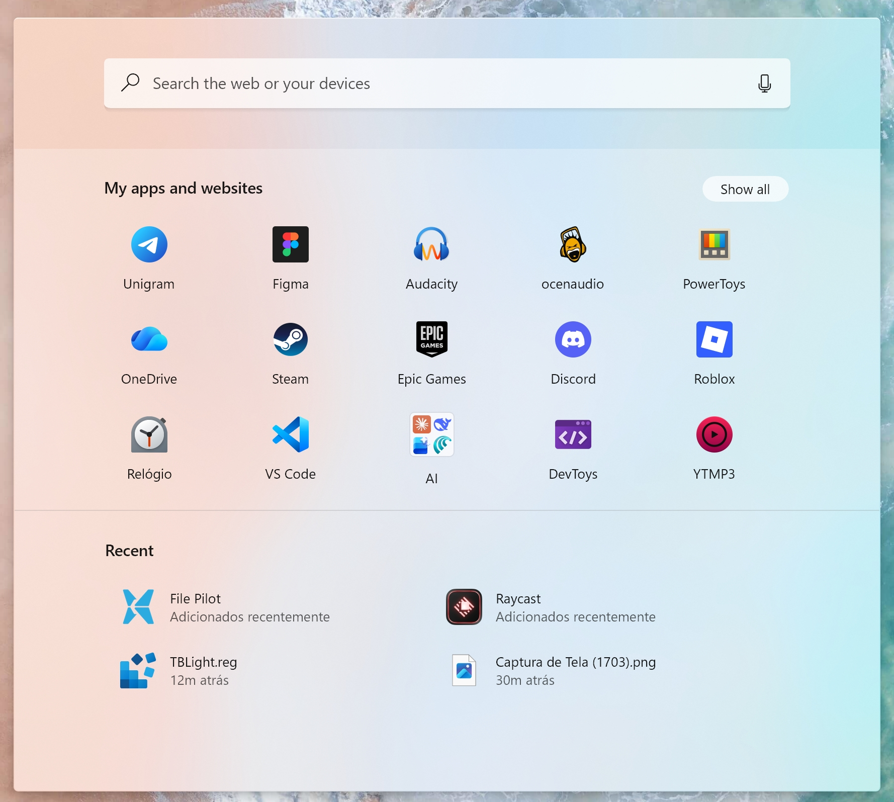
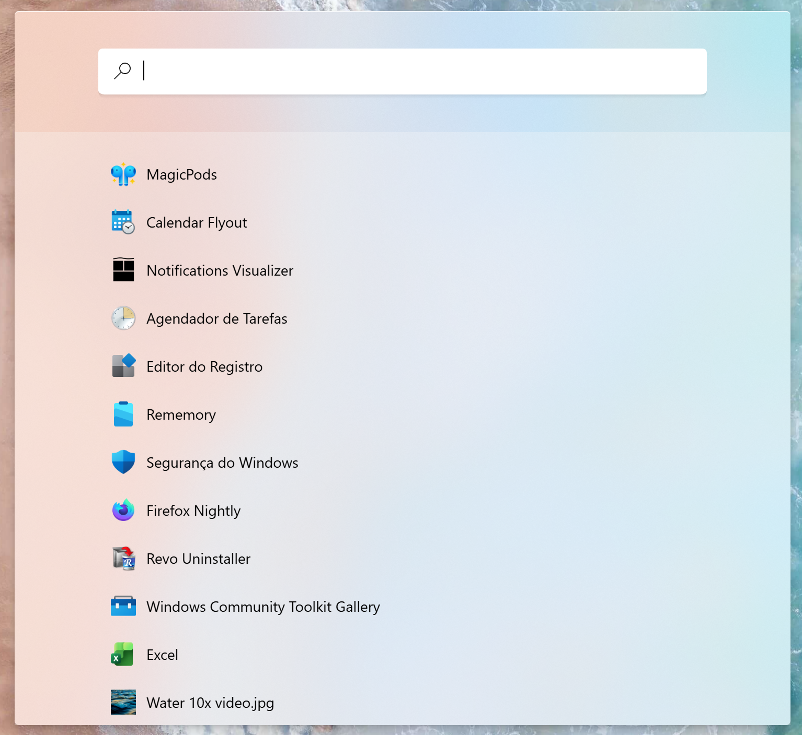

# Sun Valley Start & Search theme for Windows 11 Start Menu Styler

This theme tries to recreate the design from the scrapped Windows 10X OS.

**Author**: [Lockframe](https://github.com/Lockframe)

## Old Windows 11 Start Menu:

## Search Menu


## Theme selection

The theme is integrated into the mod and can simply be selected from the mod's
settings:

* Open the Windows 11 Start Menu Styler mod in Windhawk.
* Go to the "Settings" tab.
* Select the theme and save the settings.

## Manual installation

The theme styles can also be imported manually. To do that, follow these steps:

* Open the Windows 11 Start Menu Styler mod in Windhawk.
* Go to the "Advanced" tab.
* Copy the content below to the text box under "Mod settings" and click "Save".

### Redesigned Start menu

A variant for the [redesigned Windows 11 Start
menu](https://microsoft.design/articles/start-fresh-redesigning-windows-start-menu/)
that is slowly rolling out in the 25H2 update.

<details>
<summary>Content to import (click to expand)</summary>

```json
{
  "theme": "",
  "disableNewStartMenuLayout": 0,
  "controlStyles[0].target": "Grid#ShowMoreSuggestions",
  "controlStyles[0].styles[0]": "Visibility=1",
  "controlStyles[1].target": "Grid#TopLevelSuggestionsListHeader",
  "controlStyles[1].styles[0]": "Margin=0,10,-180,0",
  "controlStyles[1].styles[1]": "BorderThickness=0,1,0,0",
  "controlStyles[1].styles[2]": "BorderBrush:=<SolidColorBrush Color=\"{ThemeResource SurfaceStrokeColorDefault}\" Opacity=\".5\"/>",
  "controlStyles[2].target": "Grid#TopLevelHeader > Grid > Button > Grid@CommonStates > Border#BackgroundBorder",
  "controlStyles[2].styles[0]": "Background:=$button",
  "controlStyles[2].styles[1]": "Background@PointerOver:=$buttonHover",
  "controlStyles[2].styles[2]": "Background@Pressed:=$buttonPress",
  "controlStyles[2].styles[3]": "CornerRadius=12",
  "controlStyles[2].styles[4]": "Height=23",
  "controlStyles[3].target": "Border#AcrylicBorder",
  "controlStyles[3].styles[0]": "Background:=$acrylic",
  "controlStyles[3].styles[1]": "CornerRadius=4",
  "controlStyles[3].styles[2]": "BorderThickness=0,1,0,0",
  "controlStyles[3].styles[3]": "BorderBrush:=$button",
  "controlStyles[3].styles[4]": "BackgroundSizing=1",
  "controlStyles[4].target": "Grid#MainContent",
  "controlStyles[4].styles[0]": "CornerRadius=3",
  "controlStyles[4].styles[1]": "Margin=0",
  "controlStyles[5].target": "TextBlock#PinnedListHeaderText",
  "controlStyles[5].styles[0]": "Margin=78,0,0,0",
  "controlStyles[5].styles[1]": "Text=My apps and websites",
  "controlStyles[5].styles[2]": "FontFamily=Segoe UI",
  "controlStyles[6].target": "Border#TaskbarSearchBackground",
  "controlStyles[6].styles[0]": "CornerRadius=4,4,5,5",
  "controlStyles[6].styles[1]": "Margin=79,35,79,1",
  "controlStyles[6].styles[2]": "BorderThickness=0,0,0,4",
  "controlStyles[6].styles[3]": "Height=48",
  "controlStyles[6].styles[4]": "BorderBrush:=$fakeShadow",
  "controlStyles[7].target": "Border#AppBorder",
  "controlStyles[7].styles[0]": "Background:=$acrylic",
  "controlStyles[7].styles[1]": "CornerRadius=4",
  "controlStyles[7].styles[2]": "BorderThickness=0,1,0,0",
  "controlStyles[7].styles[3]": "BorderBrush:=$button",
  "controlStyles[7].styles[4]": "BackgroundSizing=1",
  "controlStyles[8].target": "Border#dropshadow",
  "controlStyles[8].styles[0]": "Canvas.ZIndex=-1",
  "controlStyles[8].styles[1]": "CornerRadius=4",
  "controlStyles[9].target": "Cortana.UI.Views.RichSearchBoxControl#SearchBoxControl",
  "controlStyles[9].styles[0]": "Margin=79,39,79,10",
  "controlStyles[10].target": "Border#ContentBorder",
  "controlStyles[10].styles[0]": "CornerRadius=4",
  "controlStyles[11].target": "ItemsWrapGrid > GridViewItem > Border > Grid > ContentPresenter > ContentControl > Grid > TextBlock",
  "controlStyles[11].styles[0]": "Visibility=1",
  "controlStyles[12].target": "Border#LayerBorder",
  "controlStyles[12].styles[0]": "Visibility=1",
  "controlStyles[13].target": "Border#LogoBackgroundPlate",
  "controlStyles[13].styles[0]": "CornerRadius=2",
  "controlStyles[14].target": "TextBlock#AppDisplayName",
  "controlStyles[14].styles[0]": "FontFamily=Segoe UI",
  "controlStyles[15].target": "Grid#WebViewGrid",
  "controlStyles[15].styles[0]": "Background=Transparent",
  "controlStyles[15].styles[1]": "Margin=0",
  "controlStyles[16].target": "Button#Header > Border#Border > TextBlock#Text",
  "controlStyles[16].styles[0]": "FontWeight=600",
  "controlStyles[16].styles[1]": "FontFamily=Segoe UI",
  "controlStyles[17].target": "Grid#QueryFormulationRoot",
  "controlStyles[17].styles[0]": "CornerRadius=0",
  "controlStyles[17].styles[1]": "BorderThickness=0",
  "controlStyles[17].styles[2]": "Margin=0,31,0,0",
  "controlStyles[17].styles[3]": "Background:=$buttonPress",
  "controlStyles[18].target": "StartDocked.LauncherFrame > Grid#RootGrid > Grid#RootContent > Grid#MainContent > Grid#InnerContent > Rectangle",
  "controlStyles[18].styles[0]": "Visibility=1",
  "controlStyles[19].target": "Border#AcrylicOverlay",
  "controlStyles[19].styles[0]": "Margin=0,51,0,-64",
  "controlStyles[19].styles[1]": "Padding=0,1,0,1",
  "controlStyles[19].styles[2]": "BorderThickness=0",
  "controlStyles[19].styles[3]": "CornerRadius=0",
  "controlStyles[20].target": "Cortana.UI.Views.RichSearchBoxControl#SearchBoxControl > Grid#RootGrid",
  "controlStyles[20].styles[0]": "CornerRadius=3",
  "controlStyles[20].styles[1]": "Margin=0,1,0,0",
  "controlStyles[20].styles[2]": "BorderThickness=0",
  "controlStyles[21].target": "FontIcon#SearchBoxOnTaskbarSearchGlyph",
  "controlStyles[21].styles[0]": "Visibility=0",
  "controlStyles[21].styles[1]": "FontFamily=Segoe MDL2 Assets",
  "controlStyles[21].styles[2]": "Glyph=",
  "controlStyles[21].styles[3]": "Margin=16,0,0,0",
  "controlStyles[22].target": "Microsoft.UI.Xaml.Controls.AnimatedIcon#SearchIconPlayer",
  "controlStyles[22].styles[0]": "Visibility=1",
  "controlStyles[23].target": "Border#LayerBorder",
  "controlStyles[23].styles[0]": "CornerRadius=4",
  "controlStyles[24].target": "Cortana.UI.Views.TaskbarSearchPage",
  "controlStyles[24].styles[0]": "Margin=-28,42,-28,0",
  "controlStyles[24].styles[1]": "MaxWidth=790",
  "controlStyles[24].styles[2]": "Width=790",
  "controlStyles[25].target": "Cortana.UI.Views.TaskbarSearchPage > Grid#RootGrid@SearchBoxInputStates > Border#TaskbarSearchBackground",
  "controlStyles[25].styles[0]": "Background:=<SolidColorBrush Color=\"{ThemeResource ControlFillColorInputActive}\"/>",
  "controlStyles[26].target": "Image#SearchIconOn",
  "controlStyles[26].styles[0]": "Visibility=1",
  "controlStyles[27].target": "FontIcon#SearchGlyph",
  "controlStyles[27].styles[0]": "Visibility=0",
  "controlStyles[28].target": "Image#SearchIconOff",
  "controlStyles[28].styles[0]": "Visibility=1",
  "controlStyles[29].target": "StartDocked.UserTileView",
  "controlStyles[29].styles[0]": "Visibility=1",
  "controlStyles[30].target": "FontIcon",
  "controlStyles[30].styles[0]": "FontFamily=Segoe MDL2 Assets",
  "controlStyles[31].target": "MenuFlyoutPresenter",
  "controlStyles[31].styles[0]": "CornerRadius=4",
  "controlStyles[31].styles[1]": "BorderThickness=0,1,0,0",
  "controlStyles[31].styles[2]": "BorderBrush:=$button",
  "controlStyles[31].styles[3]": "Background:=$acrylicMenu",
  "controlStyles[31].styles[4]": "BackgroundSizing=1",
  "controlStyles[32].target": "TextBlock#DisplayName",
  "controlStyles[32].styles[0]": "Margin=0,10,0,-16",
  "controlStyles[32].styles[1]": "FontFamily=Segoe UI",
  "controlStyles[33].target": "TextBlock#AllAppsHeading",
  "controlStyles[33].styles[0]": "Margin=17,0,0,0",
  "controlStyles[33].styles[1]": "FontFamily=Segoe UI",
  "controlStyles[34].target": "TextBlock#TopLevelSuggestionsListHeaderText",
  "controlStyles[34].styles[0]": "Margin=80,25,0,0",
  "controlStyles[34].styles[1]": "Text=Recent",
  "controlStyles[34].styles[2]": "FontFamily=Segoe UI",
  "controlStyles[35].target": "GridView#RecommendedList > Border > ScrollViewer#ScrollViewer > Border#Root > Grid > ScrollContentPresenter#ScrollContentPresenter > ItemsPresenter > ItemsWrapGrid > GridViewItem > Border#ContentBorder > Grid#DroppedFlickerWorkaroundWrapper",
  "controlStyles[35].styles[0]": "Margin=29,0,0,0",
  "controlStyles[36].target": "StartDocked.PowerOptionsView#PowerButton",
  "controlStyles[36].styles[0]": "Margin=-121,-1226,0,0",
  "controlStyles[37].target": "StartDocked.NavigationPaneButton#PowerButton > Grid > ContentPresenter > Grid > FontIcon",
  "controlStyles[37].styles[0]": "FontFamily=Segoe MDL2 Assets",
  "controlStyles[37].styles[1]": "Glyph=",
  "controlStyles[38].target": "MenuFlyoutItem",
  "controlStyles[38].styles[0]": "CornerRadius=0",
  "controlStyles[38].styles[1]": "Margin=-4,-2,-4,-2",
  "controlStyles[39].target": "TextBlock#Title",
  "controlStyles[39].styles[0]": "FontFamily=Segoe UI",
  "controlStyles[40].target": "TextBlock#Subtitle",
  "controlStyles[40].styles[0]": "FontFamily=Segoe UI",
  "controlStyles[41].target": "GridViewItem > Border#ContentBorder > Grid#DroppedFlickerWorkaroundWrapper > Border#BackgroundBorder",
  "controlStyles[41].styles[0]": "FocusVisualPrimaryThickness=0",
  "controlStyles[41].styles[1]": "FocusVisualSecondaryThickness=0",
  "controlStyles[42].target": "JumpViewUI.JumpListListView > Border > ScrollViewer > Border > Grid > ScrollContentPresenter > ItemsPresenter > ItemsStackPanel > ListViewItem",
  "controlStyles[42].styles[0]": "CornerRadius=0",
  "controlStyles[43].target": "MenuFlyoutSubItem",
  "controlStyles[43].styles[0]": "CornerRadius=0",
  "controlStyles[43].styles[1]": "Margin=-4,0,-4,0",
  "controlStyles[43].styles[2]": "Padding=11,4,11,5",
  "controlStyles[44].target": "StartDocked.LauncherFrame > Grid#RootPanel > Grid#RootGrid > Grid#RootContent > Grid#MainContent > Grid#InnerContent > Rectangle",
  "controlStyles[44].styles[0]": "Visibility=1",
  "controlStyles[45].target": "StartMenu.StartBlendedFlexFrame > Grid#FrameRoot",
  "controlStyles[45].styles[0]": "Height=708",
  "controlStyles[46].target": "Grid#MainMenu > Grid#MainContent > Grid",
  "controlStyles[46].styles[0]": "Margin=0,0,0,-40",
  "controlStyles[47].target": "StartMenu.SearchBoxToggleButton#SearchBoxToggleButton",
  "controlStyles[47].styles[0]": "Margin=79,14,79,0",
  "controlStyles[47].styles[1]": "CornerRadius=4",
  "controlStyles[47].styles[2]": "Height=48",
  "controlStyles[48].target": "StartMenu.SearchBoxToggleButton#SearchBoxToggleButton > Grid@CommonStates > Border#BorderElement",
  "controlStyles[48].styles[0]": "Background:=$button",
  "controlStyles[48].styles[1]": "Background@PointerOver:=$buttonHover",
  "controlStyles[48].styles[2]": "Background@Pressed:=$buttonPress",
  "controlStyles[48].styles[3]": "Background@Checked:=$button",
  "controlStyles[48].styles[4]": "Background@CheckedPointerOver:=$buttonHover",
  "controlStyles[48].styles[5]": "Background@CheckePressed:=$buttonPress",
  "controlStyles[48].styles[6]": "BorderThickness=0",
  "controlStyles[49].target": "StartMenu.SearchBoxToggleButton#SearchBoxToggleButton > Grid",
  "controlStyles[49].styles[0]": "BorderThickness=0,0,0,4",
  "controlStyles[49].styles[1]": "BorderBrush:=$fakeShadow",
  "controlStyles[49].styles[2]": "CornerRadius=0,0,4,4",
  "controlStyles[50].target": "StartMenu.SearchBoxToggleButton > Grid > ContentPresenter > TextBlock#PlaceholderText",
  "controlStyles[50].styles[0]": "Text=Search the web and your devices",
  "controlStyles[51].target": "Rectangle#TextCaret",
  "controlStyles[51].styles[0]": "Visibility=1",
  "controlStyles[50].styles[1]": "Foreground:=$textSecondary",
  "controlStyles[50].styles[2]": "FontFamily=Segoe UI",
  "controlStyles[50].styles[3]": "Opacity=1",
  "controlStyles[24].styles[3]": "Height=708",
  "controlStyles[24].styles[4]": "VerticalAlignment=2",
  "controlStyles[52].target": "Grid#MainMenu",
  "controlStyles[52].styles[0]": "MaxWidth=766",
  "controlStyles[52].styles[1]": "Width=766",
  "controlStyles[53].target": "GridView#AllAppsGrid > Border > ScrollViewer",
  "controlStyles[53].styles[0]": "Margin=0,51,0,0",
  "controlStyles[54].target": "Grid#TopLevelHeader > Grid > Button > Grid > ContentPresenter > StackPanel > FontIcon",
  "controlStyles[55].target": "TextBlock#ShowMorePinnedButtonText",
  "controlStyles[55].styles[0]": "Text=Show all",
  "controlStyles[54].styles[0]": "Visibility=1",
  "controlStyles[55].styles[1]": "FontFamily=Segoe UI",
  "controlStyles[55].styles[2]": "Margin=0",
  "controlStyles[55].styles[3]": "FontSize=12",
  "controlStyles[55].styles[4]": "Padding=5,0,5,0",
  "controlStyles[56].target": "Grid#TopLevelHeader > Grid > Button",
  "controlStyles[56].styles[0]": "Margin=-79,-2,79,0",
  "controlStyles[27].styles[1]": "Glyph=",
  "controlStyles[57].target": "Frame#StartFrame",
  "controlStyles[57].styles[0]": "Margin=0,0,0,-65",
  "controlStyles[58].target": "GridView#AllAppsGrid > Border > ScrollViewer > Border > Grid > ScrollContentPresenter > ItemsPresenter > ItemsWrapGrid",
  "controlStyles[58].styles[0]": "Margin=78,0,78,0",
  "controlStyles[59].target": "Grid#AllListHeading",
  "controlStyles[59].styles[0]": "BorderThickness=0,1,0,0",
  "controlStyles[60].target": "Microsoft.UI.Xaml.Controls.DropDownButton#ViewSelectionButton > Grid@CommonStates",
  "controlStyles[60].styles[0]": "Background:=$button",
  "controlStyles[60].styles[1]": "Background@PointerOver:=$buttonHover",
  "controlStyles[60].styles[2]": "Background@Pressed:=$buttonPress",
  "controlStyles[60].styles[3]": "CornerRadius=12",
  "controlStyles[61].target": "Microsoft.UI.Xaml.Controls.DropDownButton#ViewSelectionButton",
  "controlStyles[61].styles[0]": "Height=26",
  "controlStyles[62].target": "Microsoft.UI.Xaml.Controls.DropDownButton#ViewSelectionButton > Grid > ContentPresenter > TextBlock",
  "controlStyles[62].styles[0]": "FontSize=12",
  "controlStyles[63].target": "Microsoft.UI.Xaml.Controls.DropDownButton#ViewSelectionButton > Grid > Microsoft.UI.Xaml.Controls.AnimatedIcon#ChevronIcon",
  "controlStyles[63].styles[0]": "Visibility=1",
  "controlStyles[62].styles[1]": "Margin=0,-1,0,0",
  "controlStyles[62].styles[2]": "Padding=5,0,5,0",
  "controlStyles[64].target": "Microsoft.UI.Xaml.Controls.DropDownButton#ViewSelectionButton > Grid > ContentPresenter",
  "controlStyles[64].styles[0]": "VerticalAlignment=1",
  "controlStyles[59].styles[1]": "BorderBrush:=<SolidColorBrush Color=\"{ThemeResource SurfaceStrokeColorDefault}\" Opacity=\".5\"/>",
  "controlStyles[59].styles[2]": "Margin=0,25,0,0",
  "controlStyles[65].target": "TextBlock#AllListHeadingText",
  "controlStyles[65].styles[0]": "Margin=81,25,0,0",
  "controlStyles[61].styles[1]": "Margin=0,25,81,0",
  "controlStyles[66].target": "StartMenu.PinnedList#StartMenuPinnedList > Grid#Root",
  "controlStyles[66].styles[0]": "Padding=0,6,0,-6",
  "controlStyles[67].target": "StartMenu.PinnedList#StartMenuPinnedList > Grid#Root > GridView#PinnedList > Border > ScrollViewer#ScrollViewer > Border#Root > Grid > ScrollContentPresenter#ScrollContentPresenter > ItemsPresenter > ItemsWrapGrid > GridViewItem",
  "controlStyles[67].styles[0]": "Margin=0,0,31,0",
  "controlStyles[68].target": "StartMenu.PinnedList#StartMenuPinnedList",
  "controlStyles[66].styles[1]": "MaxWidth=760",
  "controlStyles[68].styles[0]": "Margin=79,0,0,0",
  "controlStyles[69].target": "GridViewHeaderItem",
  "controlStyles[69].styles[0]": "Padding=0",
  "controlStyles[70].target": "StartMenu.PinnedList#StartMenuPinnedList > Grid#Root > GridView#PinnedList > Border > ScrollViewer#ScrollViewer",
  "controlStyles[70].styles[0]": "VerticalScrollBarVisibility=Auto",
  "controlStyles[70].styles[1]": "ScrollViewer.VerticalScrollMode=1",
  "webContentStyles[0].target": "#qfPreviewPane, #qfPreviewPane *, .leftPill::before, #temporaryMessages, .scope-with-background__backButton, #gr11, #pp_Share, #pp_Review, #chatButtonRight, .curatedSettingsGroup, .scope-with-background__rightCaret, #topHitHeader, .userProfileMenuIcon, .scope-tile__button, .additionalInfoText.annotation, #root:not(.zeroInput19H1):not(.fileExplorer) .topResults .openPreviewPaneBtn .iconContent, .openPreviewIcon .iconContent.cortanaFontIcon, #scopesHeader, #scopesHeader *, #gr36, div[data-region=\"TopApps\"], #gr43, .openPreviewPaneBtn, .suggContainer.largerSearchIcon14 .secondaryText",
  "webContentStyles[0].styles[0]": "display: none !important",
  "webContentStyles[0].styles[1]": "visibility: hidden !important",
  "webContentStyles[1].target": "#qfContainer",
  "webContentStyles[1].styles[0]": "max-width: 100% !important",
  "webContentStyles[1].styles[1]": "margin-inline: 75px !important",
  "webContentStyles[1].styles[2]": "margin-top: 7px !important",
  "webContentStyles[2].target": ".cortanaFontIcon, .iconContent",
  "webContentStyles[2].styles[0]": "font-family: 'Segoe MDL2 Assets' !important",
  "webContentStyles[3].target": ".leftPill",
  "webContentStyles[3].styles[0]": "border-left: 3px solid var(--accent11) !important",
  "webContentStyles[3].styles[1]": "border-radius: 2px !important",
  "webContentStyles[4].target": ".darkTheme .leftPill",
  "webContentStyles[4].styles[0]": "border-left: 3px solid var(--accent12) !important",
  "webContentStyles[5].target": "*",
  "webContentStyles[5].styles[0]": "scrollbar-width: none !important",
  "webContentStyles[5].styles[1]": "border-color: transparent !important",
  "webContentStyles[5].styles[2]": "cursor: default !important",
  "webContentStyles[6].target": ".groupContainer.topItemsGroup",
  "webContentStyles[6].styles[0]": "order: -1 !important",
  "webContentStyles[7].target": ".leftPaneZIsuggestions",
  "webContentStyles[7].styles[0]": "margin-left: -19px !important",
  "webContentStyles[8].target": "#root.win11.zeroInput19H1:not(.fileExplorer) .groupContainer:not(.curatedSettingsGroup) .suggestion.selectable:not(.focusable), .suggContainer",
  "webContentStyles[8].styles[0]": "border-radius: 2px !important",
  "webContentStyles[8].styles[1]": "transition: all 83ms ease-out",
  "webContentStyles[9].target": "div[data-region=\"MRUHistory\"] > .suggsList, div[data-region=\"MRUHistory\"] .suggContainer",
  "webContentStyles[9].styles[0]": "width: 600px !important",
  "webContentStyles[10].target": ".suggestion:not(.groupHeader)",
  "webContentStyles[10].styles[0]": "border-radius: 4px !important",
  "webContentStyles[10].styles[1]": "clip-path: inset(1px 0px 1px 3px round 4px 2px 2px 4px) !important",
  "webContentStyles[11].target": ".suggestion[aria-selected=\"true\"] .iconContainer, .suggestion[aria-selected=\"true\"] .details",
  "webContentStyles[11].styles[0]": "margin-left: -3px !important",
  "webContentStyles[12].target": ".groupHeader",
  "webContentStyles[12].styles[0]": "margin-inline: 3px 4px !important",
  "webContentStyles[13].target": ".topResults .suggDetailsContainer",
  "webContentStyles[13].styles[0]": "min-height: 0px !important",
  "webContentStyles[14].target": ".suggDetailsContainer.limitScaleRange",
  "webContentStyles[14].styles[0]": "background: transparent !important",
  "webContentStyles[15].target": ".topResults .suggDetailsContainer .primaryText",
  "webContentStyles[15].styles[0]": "margin-bottom: -2px !important",
  "styleConstants[0]": "lightAccent=<SolidColorBrush Color=\"{ThemeResource SystemAccentColorDark1}\"/>",
  "styleConstants[1]": "lightAccentHover=<SolidColorBrush Color=\"{ThemeResource SystemAccentColorDark1}\" Opacity=\".9\"/>",
  "styleConstants[2]": "lightAccentPress=<SolidColorBrush Color=\"{ThemeResource SystemAccentColorDark1}\" Opacity=\".8\"/>",
  "styleConstants[3]": "darkAccent=<SolidColorBrush Color=\"{ThemeResource SystemAccentColorLight2}\"/>",
  "styleConstants[4]": "darkAccentHover=<SolidColorBrush Color=\"{ThemeResource SystemAccentColorLight2}\" Opacity=\".9\"/>",
  "styleConstants[5]": "darkAccentPress=<SolidColorBrush Color=\"{ThemeResource SystemAccentColorLight2}\" Opacity=\".8\"/>",
  "styleConstants[6]": "subtleButtonHover=<SolidColorBrush Color=\"{ThemeResource SubtleFillColorSecondary}\"/>",
  "styleConstants[7]": "subtleButtonPress=<SolidColorBrush Color=\"{ThemeResource SubtleFillColorTertiary}\"/>",
  "styleConstants[8]": "button=<SolidColorBrush Color=\"{ThemeResource ControlFillColorDefault}\"/>",
  "styleConstants[9]": "buttonHover=<SolidColorBrush Color=\"{ThemeResource ControlFillColorSecondary}\"/>",
  "styleConstants[10]": "buttonPress=<SolidColorBrush Color=\"{ThemeResource ControlFillColorTertiary}\"/>",
  "styleConstants[11]": "textPrimary=<SolidColorBrush Color=\"{ThemeResource TextFillColorPrimary}\"/>",
  "styleConstants[12]": "textSecondary=<SolidColorBrush Color=\"{ThemeResource TextFillColorSecondary}\"/>",
  "styleConstants[13]": "textDisabled=<SolidColorBrush Color=\"{ThemeResource TextFillColorDisabled}\"/>",
  "styleConstants[14]": "textInverse=<SolidColorBrush Color=\"{ThemeResource TextFillColorInverse}\"/>",
  "styleConstants[15]": "acrylic=<AcrylicBrush TintColor=\"{ThemeResource SystemChromeMediumColor}\" FallbackColor=\"{ThemeResource SystemChromeMediumColor}\" TintOpacity=\".0\" TintLuminosityOpacity=\".86\"/>",
  "styleConstants[16]": "fakeShadow=<LinearGradientBrush StartPoint=\"0,0\" EndPoint=\"0,1\"><GradientStop Color=\"#10000000\" Offset=\"0.84\" /><GradientStop Color=\"#26000000\" Offset=\"0.85\" /><GradientStop Color=\"#00000000\" Offset=\"1.0\" /></LinearGradientBrush>",
  "styleConstants[17]": "acrylicMenu=<AcrylicBrush TintColor=\"{ThemeResource LayerOnMicaBaseAltFillColorTertiary}\" FallbackColor=\"{ThemeResource SystemChromeHighColor}\" TintOpacity=\".0\" TintLuminosityOpacity=\".75\"/>"
}
```
</details>

### Classic Start menu

<details>
<summary>Content to import (click to expand)</summary>

```json
{
  "theme": "",
  "disableNewStartMenuLayout": 1,
  "controlStyles[0].target": "Button#CloseAllAppsButton",
  "controlStyles[0].styles[0]": "Margin=0,0,16,0",
  "controlStyles[0].styles[1]": "Padding=16,3,16,3.5",
  "controlStyles[0].styles[2]": "CornerRadius=12",
  "controlStyles[0].styles[3]": "BorderThickness=0",
  "controlStyles[1].target": "Grid#ShowMoreSuggestions",
  "controlStyles[1].styles[0]": "Visibility=1",
  "controlStyles[2].target": "Grid#TopLevelSuggestionsListHeader",
  "controlStyles[2].styles[0]": "Margin=0,-23,-180,0",
  "controlStyles[2].styles[1]": "BorderThickness=0,1,0,0",
  "controlStyles[2].styles[2]": "BorderBrush:=$separator",
  "controlStyles[3].target": "Button#ShowAllAppsButton",
  "controlStyles[3].styles[0]": "Margin=0,0,80,0",
  "controlStyles[3].styles[1]": "CornerRadius=12",
  "controlStyles[3].styles[2]": "BorderThickness=0",
  "controlStyles[3].styles[3]": "Padding=16,3,16,3.5",
  "controlStyles[4].target": "StartDocked.SearchBoxToggleButton",
  "controlStyles[4].styles[0]": "Margin=80,5,80,46",
  "controlStyles[4].styles[1]": "Height=48",
  "controlStyles[5].target": "Microsoft.UI.Xaml.Controls.PipsPager#PinnedListPipsPager",
  "controlStyles[5].styles[0]": "Visibility=1",
  "controlStyles[6].target": "Border#AcrylicBorder",
  "controlStyles[6].styles[0]": "Background:=$acrylic",
  "controlStyles[6].styles[1]": "CornerRadius=4",
  "controlStyles[6].styles[2]": "BorderThickness=0,1,0,0",
  "controlStyles[6].styles[3]": "BorderBrush:=$button",
  "controlStyles[6].styles[4]": "BackgroundSizing=1",
  "controlStyles[7].target": "Grid#MainContent",
  "controlStyles[7].styles[0]": "CornerRadius=3",
  "controlStyles[7].styles[1]": "Margin=0",
  "controlStyles[8].target": "StartMenu.PinnedList",
  "controlStyles[8].styles[0]": "Height=252",
  "controlStyles[8].styles[1]": "Margin=24,0,0,0",
  "controlStyles[9].target": "TextBlock#PinnedListHeaderText",
  "controlStyles[9].styles[0]": "Margin=16,0,0,0",
  "controlStyles[9].styles[1]": "Text=My apps and websites",
  "controlStyles[9].styles[2]": "FontFamily=Segoe UI",
  "controlStyles[10].target": "Border#TaskbarSearchBackground",
  "controlStyles[10].styles[0]": "CornerRadius=4,4,6,6",
  "controlStyles[10].styles[1]": "Margin=80,36,80,1",
  "controlStyles[10].styles[2]": "BorderThickness=0,0,0,4",
  "controlStyles[10].styles[3]": "Height=48",
  "controlStyles[10].styles[4]": "BorderBrush:=$fakeShadow",
  "controlStyles[11].target": "Border#AppBorder",
  "controlStyles[11].styles[0]": "Background:=$acrylic",
  "controlStyles[11].styles[1]": "CornerRadius=4",
  "controlStyles[11].styles[2]": "BorderThickness=0,1,0,0",
  "controlStyles[11].styles[3]": "BorderBrush:=$button",
  "controlStyles[11].styles[4]": "BackgroundSizing=1",
  "controlStyles[12].target": "Border#dropshadow",
  "controlStyles[12].styles[0]": "Canvas.ZIndex=-1",
  "controlStyles[12].styles[1]": "CornerRadius=4",
  "controlStyles[13].target": "Cortana.UI.Views.RichSearchBoxControl#SearchBoxControl",
  "controlStyles[13].styles[0]": "Margin=79,39,79,10",
  "controlStyles[14].target": "Border#ContentBorder",
  "controlStyles[14].styles[0]": "CornerRadius=4",
  "controlStyles[15].target": "TextBlock#StatusMessage",
  "controlStyles[15].styles[0]": "Visibility=1",
  "controlStyles[16].target": "Border#LayerBorder",
  "controlStyles[16].styles[0]": "Visibility=1",
  "controlStyles[17].target": "Border#LogoBackgroundPlate",
  "controlStyles[17].styles[0]": "CornerRadius=2",
  "controlStyles[18].target": "TextBlock#AppDisplayName",
  "controlStyles[18].styles[0]": "Margin=-4,0,0,0",
  "controlStyles[18].styles[1]": "FontFamily=Segoe UI",
  "controlStyles[19].target": "Grid#WebViewGrid",
  "controlStyles[19].styles[0]": "Background=Transparent",
  "controlStyles[19].styles[1]": "Margin=0",
  "controlStyles[20].target": "Border#DropShadow",
  "controlStyles[20].styles[0]": "Canvas.ZIndex=-1",
  "controlStyles[20].styles[1]": "CornerRadius=4",
  "controlStyles[21].target": "Button#Header > Border#Border > TextBlock#Text",
  "controlStyles[21].styles[0]": "FontWeight=600",
  "controlStyles[21].styles[1]": "FontFamily=Segoe UI",
  "controlStyles[22].target": "Grid#QueryFormulationRoot",
  "controlStyles[22].styles[0]": "CornerRadius=0",
  "controlStyles[22].styles[1]": "BorderThickness=0",
  "controlStyles[22].styles[2]": "Margin=0,31,0,0",
  "controlStyles[22].styles[3]": "Background:=$buttonPress",
  "controlStyles[23].target": "StartDocked.SearchBoxToggleButton > Grid > ContentPresenter > TextBlock#PlaceholderText",
  "controlStyles[23].styles[0]": "Text=Search the web or your devices",
  "controlStyles[23].styles[1]": "Margin=0",
  "controlStyles[23].styles[2]": "Foreground:=$textSecondary",
  "controlStyles[23].styles[3]": "FontFamily=Segoe UI",
  "controlStyles[24].target": "TextBlock#ShowAllAppsButtonText",
  "controlStyles[24].styles[0]": "Margin=0",
  "controlStyles[24].styles[1]": "Text=Show all",
  "controlStyles[24].styles[2]": "FontFamily=Segoe UI",
  "controlStyles[25].target": "Button#CloseAllAppsButton > ContentPresenter > StackPanel > TextBlock",
  "controlStyles[25].styles[0]": "Margin=8,-1,0,0",
  "controlStyles[25].styles[1]": "FontFamily=Segoe UI",
  "controlStyles[26].target": "Button#CloseAllAppsButton > ContentPresenter > StackPanel > FontIcon > Grid > TextBlock",
  "controlStyles[26].styles[0]": "Margin=-2,0,0,0",
  "controlStyles[26].styles[1]": "FontFamily=Segoe UI",
  "controlStyles[27].target": "StartDocked.LauncherFrame > Grid#RootGrid > Grid#RootContent > Grid#MainContent > Grid#InnerContent > Rectangle",
  "controlStyles[27].styles[0]": "Visibility=1",
  "controlStyles[28].target": "Border#AcrylicOverlay",
  "controlStyles[28].styles[0]": "Margin=0,115,0,-64",
  "controlStyles[28].styles[1]": "Padding=0,1,0,1",
  "controlStyles[28].styles[2]": "BorderThickness=0",
  "controlStyles[28].styles[3]": "CornerRadius=0",
  "controlStyles[29].target": "Cortana.UI.Views.RichSearchBoxControl#SearchBoxControl > Grid#RootGrid",
  "controlStyles[29].styles[0]": "CornerRadius=3",
  "controlStyles[29].styles[1]": "Margin=0,1,0,0",
  "controlStyles[29].styles[2]": "BorderThickness=0",
  "controlStyles[30].target": "FontIcon#SearchBoxOnTaskbarSearchGlyph",
  "controlStyles[30].styles[0]": "Visibility=0",
  "controlStyles[31].target": "Microsoft.UI.Xaml.Controls.AnimatedIcon#SearchIconPlayer",
  "controlStyles[31].styles[0]": "Visibility=1",
  "controlStyles[32].target": "StartDocked.SearchBoxToggleButton#StartMenuSearchBox > Grid@CommonStates",
  "controlStyles[32].styles[0]": "CornerRadius=0,0,5,5",
  "controlStyles[32].styles[1]": "BorderThickness=0,0,0,4",
  "controlStyles[32].styles[2]": "BorderBrush:=$fakeShadow",
  "controlStyles[32].styles[3]": "Background:=transparent",
  "controlStyles[33].target": "StartDocked.SearchBoxToggleButton#StartMenuSearchBox > Grid@CommonStates > Border#BorderElement",
  "controlStyles[33].styles[0]": "CornerRadius=3",
  "controlStyles[33].styles[1]": "Margin=-1,0,-1,0",
  "controlStyles[33].styles[2]": "Background=Transparent",
  "controlStyles[33].styles[3]": "BorderThickness=0",
  "controlStyles[34].target": "StartDocked.SearchBoxToggleButton#StartMenuSearchBox > Grid@CommonStates > FontIcon > Grid > TextBlock",
  "controlStyles[34].styles[0]": "Margin=-1,0,0,1",
  "controlStyles[34].styles[1]": "FontFamily=Segoe MDL2 Assets",
  "controlStyles[34].styles[2]": "Text=",
  "controlStyles[34].styles[3]": "Foreground:=<SolidColorBrush Color=\"{ThemeResource FocusStrokeColorOuter}\"/>",
  "controlStyles[35].target": "Border#LayerBorder",
  "controlStyles[35].styles[0]": "CornerRadius=4",
  "controlStyles[36].target": "Cortana.UI.Views.TaskbarSearchPage",
  "controlStyles[36].styles[0]": "Margin=-28,42,-28,0",
  "controlStyles[36].styles[1]": "MaxWidth=790",
  "controlStyles[36].styles[2]": "Width=790",
  "controlStyles[36].styles[3]": "Height=708",
  "controlStyles[36].styles[4]": "VerticalAlignment=2",
  "controlStyles[37].target": "Cortana.UI.Views.TaskbarSearchPage > Grid#RootGrid@SearchBoxInputStates > Border#TaskbarSearchBackground",
  "controlStyles[37].styles[0]": "Background:=$inputActive",
  "controlStyles[38].target": "Image#SearchIconOn",
  "controlStyles[38].styles[0]": "Visibility=1",
  "controlStyles[39].target": "FontIcon#SearchGlyph",
  "controlStyles[39].styles[0]": "Visibility=0",
  "controlStyles[40].target": "Image#SearchIconOff",
  "controlStyles[40].styles[0]": "Visibility=1",
  "controlStyles[41].target": "FontIcon#SearchBoxOnTaskbarSearchGlyph",
  "controlStyles[41].styles[0]": "FontFamily=Segoe MDL2 Assets",
  "controlStyles[41].styles[1]": "Glyph=",
  "controlStyles[42].target": "GridView#PinnedList > Border > ScrollViewer#ScrollViewer > Border#Root > Grid # ScrollContentPresenter#ScrollContentPresenter > ItemsPresenter > GridViewItem > Border#ContentBorder > Grid#DroppedFlickerWorkaroundWrapper > ContentPresenter#ContentPresenter > Grid",
  "controlStyles[42].styles[0]": "Height=84",
  "controlStyles[42].styles[1]": "Width=100",
  "controlStyles[43].target": "GridView#PinnedList > Border > ScrollViewer > Border > Grid > ScrollContentPresenter > ItemsPresenter > ItemsWrapGrid > GridViewItem > Border#ContentBorder > Grid#DroppedFlickerWorkaroundWrapper",
  "controlStyles[43].styles[0]": "Margin=29,0,0,0",
  "controlStyles[44].target": "StartDocked.UserTileView",
  "controlStyles[44].styles[0]": "Visibility=1",
  "controlStyles[45].target": "Button#ShowAllAppsButton > ContentPresenter > StackPanel > FontIcon",
  "controlStyles[45].styles[0]": "Visibility=1",
  "controlStyles[46].target": "Button#CloseAllAppsButton > ContentPresenter > StackPanel > FontIcon",
  "controlStyles[46].styles[0]": "Visibility=1",
  "controlStyles[47].target": "Button#CloseAllAppsButton > ContentPresenter > StackPanel > TextBlock",
  "controlStyles[47].styles[0]": "Margin=0",
  "controlStyles[47].styles[1]": "FontFamily=Segoe UI",
  "controlStyles[48].target": "StartDocked.AllAppsPane#AllAppsPanel",
  "controlStyles[48].styles[0]": "Margin=28,0,28,-65",
  "controlStyles[49].target": "FontIcon",
  "controlStyles[49].styles[0]": "FontFamily=Segoe MDL2 Assets",
  "controlStyles[50].target": "MenuFlyoutPresenter",
  "controlStyles[50].styles[0]": "CornerRadius=4",
  "controlStyles[50].styles[1]": "BorderThickness=0,1,0,0",
  "controlStyles[50].styles[2]": "BorderBrush:=$button",
  "controlStyles[50].styles[3]": "BackgroundSizing=1",
  "controlStyles[51].target": "StartDocked.StartSizingFrame",
  "controlStyles[51].styles[0]": "MaxHeight=684",
  "controlStyles[51].styles[1]": "Height=684",
  "controlStyles[51].styles[2]": "MaxWidth=766",
  "controlStyles[51].styles[3]": "MinWidth=766",
  "controlStyles[52].target": "TextBlock#DisplayName",
  "controlStyles[52].styles[0]": "Margin=0,10,0,-16",
  "controlStyles[52].styles[1]": "FontFamily=Segoe UI",
  "controlStyles[53].target": "TextBlock#AllAppsHeading",
  "controlStyles[53].styles[0]": "Margin=17,0,0,0",
  "controlStyles[53].styles[1]": "FontFamily=Segoe UI",
  "controlStyles[54].target": "TextBlock#TopLevelSuggestionsListHeaderText",
  "controlStyles[54].styles[0]": "Margin=80,25,0,0",
  "controlStyles[54].styles[1]": "Text=Recent",
  "controlStyles[54].styles[2]": "FontFamily=Segoe UI",
  "controlStyles[55].target": "GridView#RecommendedList > Border > ScrollViewer#ScrollViewer > Border#Root > Grid > ScrollContentPresenter#ScrollContentPresenter > ItemsPresenter > ItemsWrapGrid > GridViewItem > Border#ContentBorder > Grid#DroppedFlickerWorkaroundWrapper",
  "controlStyles[55].styles[0]": "Margin=0",
  "controlStyles[56].target": "GridView#RecommendedList",
  "controlStyles[56].styles[0]": "Margin=53,0,0,0",
  "controlStyles[57].target": "Windows.UI.Xaml.Controls.Primitives.ScrollBar#VerticalScrollBar",
  "controlStyles[57].styles[0]": "Margin=0,0,42,0",
  "controlStyles[58].target": "StartDocked.PowerOptionsView#PowerButton",
  "controlStyles[58].styles[0]": "Margin=-70,-1188,0,0",
  "controlStyles[59].target": "StartDocked.NavigationPaneButton#PowerButton > Grid > ContentPresenter > Grid > FontIcon",
  "controlStyles[59].styles[0]": "FontFamily=Segoe MDL2 Assets",
  "controlStyles[59].styles[1]": "Glyph=",
  "controlStyles[60].target": "MenuFlyoutItem",
  "controlStyles[60].styles[0]": "CornerRadius=0",
  "controlStyles[60].styles[1]": "Margin=-4,-2,-4,-2",
  "controlStyles[61].target": "GridView#PinnedList > ItemsWrapGrid > GridViewItem > Border#ContentBorder > Grid#DroppedFlickerWorkaroundWrapper",
  "controlStyles[61].styles[0]": "Margin=32,0,0,0",
  "controlStyles[62].target": "TextBlock#Title",
  "controlStyles[62].styles[0]": "FontFamily=Segoe UI",
  "controlStyles[63].target": "TextBlock#Subtitle",
  "controlStyles[63].styles[0]": "FontFamily=Segoe UI",
  "controlStyles[64].target": "GridViewItem > Border#ContentBorder > Grid#DroppedFlickerWorkaroundWrapper > Border#BackgroundBorder",
  "controlStyles[64].styles[0]": "FocusVisualPrimaryThickness=0",
  "controlStyles[64].styles[1]": "FocusVisualSecondaryThickness=0",
  "controlStyles[65].target": "JumpViewUI.JumpListListView > Border > ScrollViewer > Border > Grid > ScrollContentPresenter > ItemsPresenter > ItemsStackPanel > ListViewItem",
  "controlStyles[65].styles[0]": "CornerRadius=0",
  "controlStyles[66].target": "MenuFlyoutSubItem",
  "controlStyles[66].styles[0]": "CornerRadius=0",
  "controlStyles[66].styles[1]": "Margin=-4,0,-4,0",
  "controlStyles[66].styles[2]": "Padding=11,4,11,5",
  "controlStyles[67].target": "StartDocked.LauncherFrame > Grid#RootPanel > Grid#RootGrid > Grid#RootContent > Grid#MainContent > Grid#InnerContent > Rectangle",
  "controlStyles[67].styles[0]": "Visibility=1",
  "controlStyles[68].target": "StartDocked.LauncherFrame > Grid#RootPanel > Grid#RootGrid",
  "controlStyles[68].styles[0]": "MinWidth=766",
  "controlStyles[69].target": "Grid#UndockedRoot",
  "controlStyles[69].styles[0]": "Height=553",
  "controlStyles[69].styles[1]": "Margin=0,0,0,-64",
  "controlStyles[70].target": "StartDocked.SearchBoxToggleButton#StartMenuSearchBox > Grid@CommonStates > Border#BorderElement",
  "controlStyles[70].styles[0]": "Background:=$button",
  "controlStyles[70].styles[1]": "Background@PointerOver:=$buttonHover",
  "controlStyles[70].styles[2]": "Background@Pressed:=$buttonPress",
  "controlStyles[70].styles[3]": "Background@Checked:=$button",
  "controlStyles[70].styles[4]": "Background@CheckedPointerOver:=$buttonHover",
  "controlStyles[70].styles[5]": "Background@CheckedPressed:=$buttonPress",
  "controlStyles[70].styles[6]": "CornerRadius=4",
  "controlStyles[70].styles[7]": "Margin=0",
  "controlStyles[71].target": "Grid#NoTopLevelSuggestionsText > TextBlock",
  "controlStyles[71].styles[0]": "Text=The more you use your device, the more we'll show your recent files and new apps here",
  "controlStyles[71].styles[1]": "FontFamily=Segoe UI",
  "controlStyles[72].target": "Grid#NoTopLevelSuggestionsText",
  "controlStyles[72].styles[0]": "Margin=152,0,0,0",
  "controlStyles[73].target": "TextBlock#NoSuggestionsWithoutSettingsLink",
  "controlStyles[73].styles[0]": "Visibility=1",
  "webContentStyles[0].target": "#qfPreviewPane, #qfPreviewPane *, .leftPill::before, #temporaryMessages, .scope-with-background__backButton, #gr11, #pp_Share, #pp_Review, #chatButtonRight, .curatedSettingsGroup, .scope-with-background__rightCaret, #topHitHeader, .userProfileMenuIcon, .scope-tile__button, .additionalInfoText.annotation, #root:not(.zeroInput19H1):not(.fileExplorer) .topResults .openPreviewPaneBtn .iconContent, .openPreviewIcon .iconContent.cortanaFontIcon, #scopesHeader, #scopesHeader *, #gr36, div[data-region=\"TopApps\"], #gr43, .openPreviewPaneBtn, .suggContainer.largerSearchIcon14 .secondaryText",
  "webContentStyles[0].styles[0]": "display: none !important",
  "webContentStyles[0].styles[1]": "visibility: hidden !important",
  "webContentStyles[1].target": "#qfContainer",
  "webContentStyles[1].styles[0]": "max-width: 100% !important",
  "webContentStyles[1].styles[1]": "margin-inline: 75px !important",
  "webContentStyles[1].styles[2]": "margin-top: 7px !important",
  "webContentStyles[2].target": ".cortanaFontIcon, .iconContent",
  "webContentStyles[2].styles[0]": "font-family: 'Segoe MDL2 Assets' !important",
  "webContentStyles[3].target": ".leftPill",
  "webContentStyles[3].styles[0]": "border-left: 3px solid var(--accent11) !important",
  "webContentStyles[3].styles[1]": "border-radius: 2px !important",
  "webContentStyles[4].target": ".darkTheme .leftPill",
  "webContentStyles[4].styles[0]": "border-left: 3px solid var(--accent12) !important",
  "webContentStyles[5].target": "*",
  "webContentStyles[5].styles[0]": "scrollbar-width: none !important",
  "webContentStyles[5].styles[2]": "cursor: default !important",
  "webContentStyles[5].styles[1]": "border-color: transparent !important",
  "webContentStyles[6].target": ".groupContainer.topItemsGroup",
  "webContentStyles[6].styles[0]": "order: -1 !important",
  "webContentStyles[7].target": ".leftPaneZIsuggestions",
  "webContentStyles[7].styles[0]": "margin-left: -19px !important",
  "webContentStyles[8].target": "#root.win11.zeroInput19H1:not(.fileExplorer) .groupContainer:not(.curatedSettingsGroup) .suggestion.selectable:not(.focusable), .suggContainer",
  "webContentStyles[8].styles[0]": "border-radius: 2px !important",
  "webContentStyles[8].styles[1]": "transition: all 83ms ease-out",
  "webContentStyles[9].target": "div[data-region=\"MRUHistory\"] > .suggsList, div[data-region=\"MRUHistory\"] .suggContainer",
  "webContentStyles[9].styles[0]": "width: 578px !important",
  "webContentStyles[10].target": ".suggestion:not(.groupHeader)",
  "webContentStyles[10].styles[0]": "border-radius: 4px !important",
  "webContentStyles[10].styles[1]": "clip-path: inset(1px 0px 1px 3px round 4px 2px 2px 4px) !important",
  "webContentStyles[11].target": ".suggestion[aria-selected=\"true\"] .iconContainer, .suggestion[aria-selected=\"true\"] .details",
  "webContentStyles[11].styles[0]": "margin-left: -3px !important",
  "webContentStyles[12].target": ".groupHeader",
  "webContentStyles[12].styles[0]": "margin-inline: 3px 4px !important",
  "webContentStyles[13].target": ".topResults .suggDetailsContainer",
  "webContentStyles[13].styles[0]": "min-height: 0px !important",
  "webContentStyles[14].target": ".suggDetailsContainer.limitScaleRange",
  "webContentStyles[14].styles[0]": "background: transparent !important",
  "webContentStyles[15].target": ".topResults .suggDetailsContainer .primaryText",
  "webContentStyles[15].styles[0]": "margin-bottom: -2px !important",
  "webContentCustomJs": "",
  "styleConstants[0]": "accent=<SolidColorBrush Color=\"{ThemeResource SystemAccentColor}\"/>",
  "styleConstants[1]": "accentHover=<SolidColorBrush Color=\"{ThemeResource SystemAccentColor}\" Opacity=\".9\"/>",
  "styleConstants[2]": "accentPress=<SolidColorBrush Color=\"{ThemeResource SystemAccentColor}\" Opacity=\".8\"/>",
  "styleConstants[3]": "subtleButtonHover=<SolidColorBrush Color=\"{ThemeResource SubtleFillColorSecondary}\"/>",
  "styleConstants[4]": "subtleButtonPress=<SolidColorBrush Color=\"{ThemeResource SubtleFillColorTertiary}\"/>",
  "styleConstants[5]": "button=<SolidColorBrush Color=\"{ThemeResource ControlFillColorDefault}\"/>",
  "styleConstants[6]": "buttonHover=<SolidColorBrush Color=\"{ThemeResource ControlFillColorSecondary}\"/>",
  "styleConstants[7]": "buttonPress=<SolidColorBrush Color=\"{ThemeResource ControlFillColorTertiary}\"/>",
  "styleConstants[8]": "textPrimary=<SolidColorBrush Color=\"{ThemeResource TextFillColorPrimary}\"/>",
  "styleConstants[9]": "textSecondary=<SolidColorBrush Color=\"{ThemeResource TextFillColorSecondary}\"/>",
  "styleConstants[10]": "textDisabled=<SolidColorBrush Color=\"{ThemeResource TextFillColorDisabled}\"/>",
  "styleConstants[11]": "textInverse=<SolidColorBrush Color=\"{ThemeResource TextFillColorInverse}\"/>",
  "styleConstants[12]": "acrylic=<AcrylicBrush TintColor=\"{ThemeResource SystemChromeMediumColor}\" FallbackColor=\"{ThemeResource SystemChromeMediumColor}\" TintOpacity=\"0\" TintLuminosityOpacity=\"1\"/>",
  "styleConstants[13]": "fakeShadow=<LinearGradientBrush StartPoint=\"0,0\" EndPoint=\"0,1\"><GradientStop Color=\"#10000000\" Offset=\"0.84\" /><GradientStop Color=\"#26000000\" Offset=\"0.85\" /><GradientStop Color=\"#00000000\" Offset=\"1.0\" /></LinearGradientBrush>",
  "styleConstants[14]": "inputActive=<SolidColorBrush Color=\"{ThemeResource ControlFillColorInputActive}\"/>",
  "styleConstants[15]": "separator=<SolidColorBrush Color=\"{ThemeResource SurfaceStrokeColorDefault}\" Opacity=\".5\"/>",
  "resourceVariables[0].variableKey": "",
  "resourceVariables[0].value": ""
}
```
</details>
