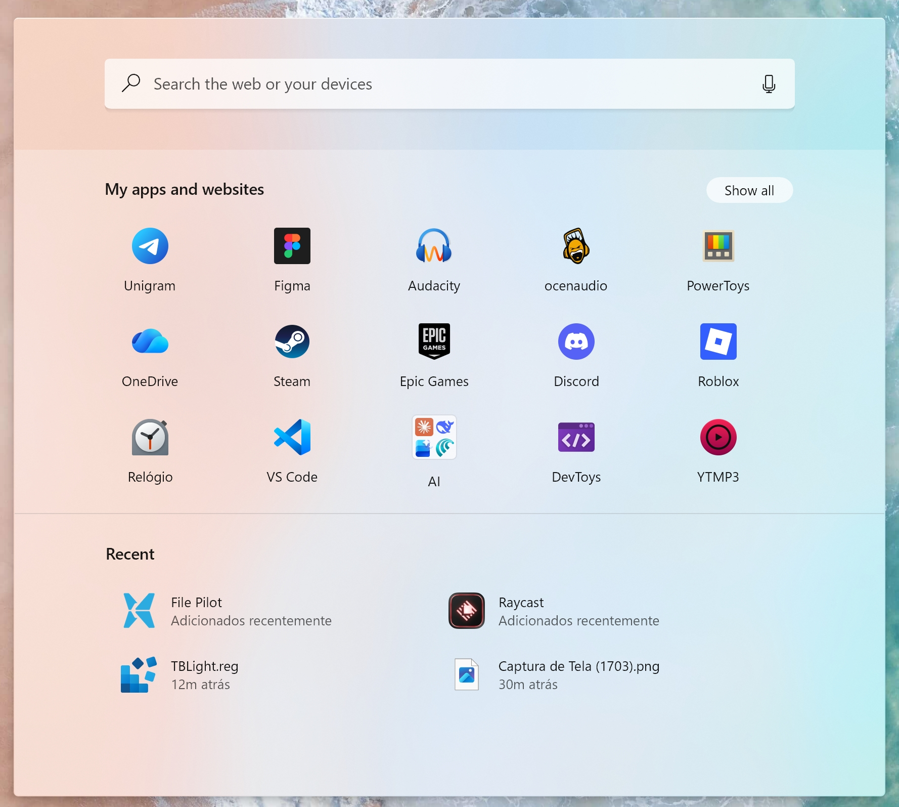
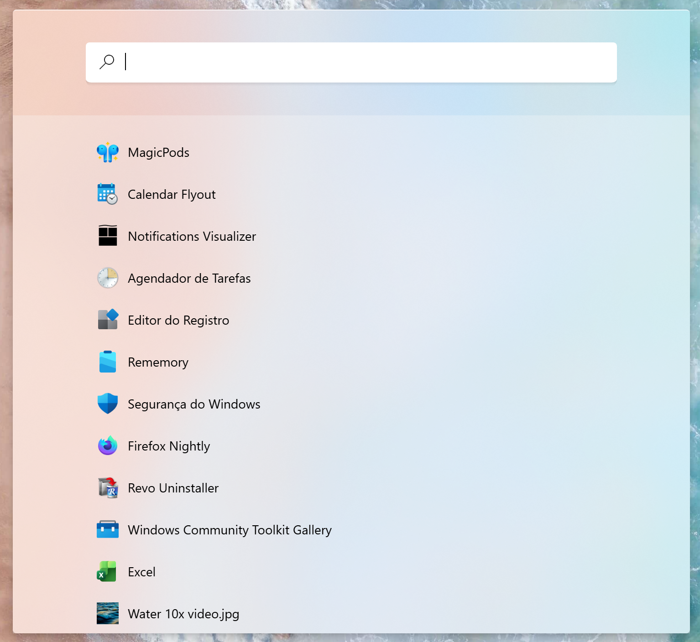

# Windows10X theme for Windows 11 Start Menu Styler

This theme tries to recreate the design from the scrapped Windows 10X OS.

**Author**: [Lockframe](https://github.com/Lockframe)

## Old Windows 11 Start Menu:

## Search Menu


## Theme selection

The theme is integrated into the mod and can be selected directly from the mod's
settings:

* Open the Windows 11 Start Menu Styler mod in Windhawk.
* Go to the "Settings" tab.
* Select the theme and save the settings.

## Manual installation

The theme styles can also be imported manually. To do that, follow these steps:

* Open the Windows 11 Start Menu Styler mod in Windhawk.
* Go to the "Settings" tab and select "Textual mode".
* Copy the content below to the text box and click "Save settings".

### Redesigned Start menu

A variant for the [redesigned Windows 11 Start
menu](https://microsoft.design/articles/start-fresh-redesigning-windows-start-menu/)
that is slowly rolling out in the 25H2 update.

<details>
<summary>Content to import (click to expand)</summary>

```yaml
styleConstants:
  - lightAccent=<SolidColorBrush Color="{ThemeResource SystemAccentColorDark1}"/>
  - lightAccentHover=<SolidColorBrush Color="{ThemeResource SystemAccentColorDark1}" Opacity=".9"/>
  - lightAccentPress=<SolidColorBrush Color="{ThemeResource SystemAccentColorDark1}" Opacity=".8"/>
  - darkAccent=<SolidColorBrush Color="{ThemeResource SystemAccentColorLight2}"/>
  - darkAccentHover=<SolidColorBrush Color="{ThemeResource SystemAccentColorLight2}" Opacity=".9"/>
  - darkAccentPress=<SolidColorBrush Color="{ThemeResource SystemAccentColorLight2}" Opacity=".8"/>
  - subtleButtonHover=<SolidColorBrush Color="{ThemeResource SubtleFillColorSecondary}"/>
  - subtleButtonPress=<SolidColorBrush Color="{ThemeResource SubtleFillColorTertiary}"/>
  - button=<SolidColorBrush Color="{ThemeResource ControlFillColorDefault}"/>
  - buttonHover=<SolidColorBrush Color="{ThemeResource ControlFillColorSecondary}"/>
  - buttonPress=<SolidColorBrush Color="{ThemeResource ControlFillColorTertiary}"/>
  - textPrimary=<SolidColorBrush Color="{ThemeResource TextFillColorPrimary}"/>
  - textSecondary=<SolidColorBrush Color="{ThemeResource TextFillColorSecondary}"/>
  - textDisabled=<SolidColorBrush Color="{ThemeResource TextFillColorDisabled}"/>
  - textInverse=<SolidColorBrush Color="{ThemeResource TextFillColorInverse}"/>
  - acrylic=<AcrylicBrush TintColor="{ThemeResource SystemChromeMediumColor}" FallbackColor="{ThemeResource SystemChromeMediumColor}" TintOpacity=".0" TintLuminosityOpacity=".86"/>
  - fakeShadow=<LinearGradientBrush StartPoint="0,0" EndPoint="0,1"><GradientStop Color="#10000000" Offset="0.84" /><GradientStop Color="#26000000" Offset="0.85" /><GradientStop Color="#00000000" Offset="1.0" /></LinearGradientBrush>
  - acrylicMenu=<AcrylicBrush TintColor="{ThemeResource LayerOnMicaBaseAltFillColorTertiary}" FallbackColor="{ThemeResource SystemChromeHighColor}" TintOpacity=".0" TintLuminosityOpacity=".75"/>
controlStyles:
  - target: Grid#ShowMoreSuggestions
    styles:
      - Visibility=1
  - target: Grid#TopLevelSuggestionsListHeader
    styles:
      - Margin=0,10,-180,0
      - BorderThickness=0,1,0,0
      - BorderBrush:=<SolidColorBrush Color="{ThemeResource SurfaceStrokeColorDefault}" Opacity=".5"/>
  - target: Grid#TopLevelHeader > Grid > Button > Grid@CommonStates > Border#BackgroundBorder
    styles:
      - Background:=$button
      - Background@PointerOver:=$buttonHover
      - Background@Pressed:=$buttonPress
      - CornerRadius=12
      - Height=23
  - target: Border#AcrylicBorder
    styles:
      - Background:=$acrylic
      - CornerRadius=4
      - BorderThickness=0,1,0,0
      - BorderBrush:=$button
      - BackgroundSizing=1
  - target: Grid#MainContent
    styles:
      - CornerRadius=3
      - Margin=0
  - target: TextBlock#PinnedListHeaderText
    styles:
      - Margin=78,0,0,0
      - Text=My apps and websites
      - FontFamily=Segoe UI
  - target: Border#TaskbarSearchBackground
    styles:
      - CornerRadius=4,4,5,5
      - Margin=79,35,79,1
      - BorderThickness=0,0,0,4
      - Height=48
      - BorderBrush:=$fakeShadow
  - target: Border#AppBorder
    styles:
      - Background:=$acrylic
      - CornerRadius=4
      - BorderThickness=0,1,0,0
      - BorderBrush:=$button
      - BackgroundSizing=1
  - target: Border#dropshadow
    styles:
      - Canvas.ZIndex=-1
      - CornerRadius=4
  - target: Cortana.UI.Views.RichSearchBoxControl#SearchBoxControl
    styles:
      - Margin=79,39,79,10
  - target: Border#ContentBorder
    styles:
      - CornerRadius=4
  - target: ItemsWrapGrid > GridViewItem > Border > Grid > ContentPresenter > ContentControl > Grid > TextBlock
    styles:
      - Visibility=1
  - target: Border#LayerBorder
    styles:
      - Visibility=1
  - target: Border#LogoBackgroundPlate
    styles:
      - CornerRadius=2
  - target: TextBlock#AppDisplayName
    styles:
      - FontFamily=Segoe UI
  - target: Grid#WebViewGrid
    styles:
      - Background=Transparent
      - Margin=0
  - target: Button#Header > Border#Border > TextBlock#Text
    styles:
      - FontWeight=600
      - FontFamily=Segoe UI
  - target: Grid#QueryFormulationRoot
    styles:
      - CornerRadius=0
      - BorderThickness=0
      - Margin=0,31,0,0
      - Background:=$buttonPress
  - target: StartDocked.LauncherFrame > Grid#RootGrid > Grid#RootContent > Grid#MainContent > Grid#InnerContent > Rectangle
    styles:
      - Visibility=1
  - target: Border#AcrylicOverlay
    styles:
      - Margin=0,51,0,-64
      - Padding=0,1,0,1
      - BorderThickness=0
      - CornerRadius=0
  - target: Cortana.UI.Views.RichSearchBoxControl#SearchBoxControl > Grid#RootGrid
    styles:
      - CornerRadius=3
      - Margin=0,1,0,0
      - BorderThickness=0
  - target: FontIcon#SearchBoxOnTaskbarSearchGlyph
    styles:
      - Visibility=0
      - FontFamily=Segoe MDL2 Assets
      - Glyph=
      - Margin=16,0,0,0
  - target: Microsoft.UI.Xaml.Controls.AnimatedIcon#SearchIconPlayer
    styles:
      - Visibility=1
  - target: Border#LayerBorder
    styles:
      - CornerRadius=4
  - target: Cortana.UI.Views.TaskbarSearchPage
    styles:
      - Margin=-28,42,-28,0
      - MaxWidth=790
      - Width=790
      - Height=708
      - VerticalAlignment=2
  - target: Cortana.UI.Views.TaskbarSearchPage > Grid#RootGrid@SearchBoxInputStates > Border#TaskbarSearchBackground
    styles:
      - Background:=<SolidColorBrush Color="{ThemeResource ControlFillColorInputActive}"/>
  - target: Image#SearchIconOn
    styles:
      - Visibility=1
  - target: FontIcon#SearchGlyph
    styles:
      - Visibility=0
      - Glyph=
  - target: Image#SearchIconOff
    styles:
      - Visibility=1
  - target: StartDocked.UserTileView
    styles:
      - Visibility=1
  - target: FontIcon
    styles:
      - FontFamily=Segoe MDL2 Assets
  - target: MenuFlyoutPresenter
    styles:
      - CornerRadius=4
      - BorderThickness=0,1,0,0
      - BorderBrush:=$button
      - Background:=$acrylicMenu
      - BackgroundSizing=1
  - target: TextBlock#DisplayName
    styles:
      - Margin=0,6,0,-16
      - FontFamily=Segoe UI
  - target: TextBlock#AllAppsHeading
    styles:
      - Margin=17,0,0,0
      - FontFamily=Segoe UI
  - target: TextBlock#TopLevelSuggestionsListHeaderText
    styles:
      - Margin=80,25,0,0
      - Text=Recent
      - FontFamily=Segoe UI
  - target: GridView#RecommendedList > Border > ScrollViewer#ScrollViewer > Border#Root > Grid > ScrollContentPresenter#ScrollContentPresenter > ItemsPresenter > ItemsWrapGrid > GridViewItem > Border#ContentBorder > Grid#DroppedFlickerWorkaroundWrapper
    styles:
      - Margin=29,0,0,0
  - target: StartDocked.PowerOptionsView#PowerButton
    styles:
      - Margin=-121,-1230,0,0
  - target: StartDocked.NavigationPaneButton#PowerButton > Grid > ContentPresenter > Grid > FontIcon
    styles:
      - FontFamily=Segoe MDL2 Assets
      - Glyph=
  - target: MenuFlyoutItem
    styles:
      - CornerRadius=0
      - Margin=-4,-2,-4,-2
  - target: TextBlock#Title
    styles:
      - FontFamily=Segoe UI
  - target: TextBlock#Subtitle
    styles:
      - FontFamily=Segoe UI
  - target: GridViewItem > Border#ContentBorder > Grid#DroppedFlickerWorkaroundWrapper > Border#BackgroundBorder
    styles:
      - FocusVisualPrimaryThickness=0
      - FocusVisualSecondaryThickness=0
  - target: JumpViewUI.JumpListListView > Border > ScrollViewer > Border > Grid > ScrollContentPresenter > ItemsPresenter > ItemsStackPanel > ListViewItem
    styles:
      - CornerRadius=0
  - target: MenuFlyoutSubItem
    styles:
      - CornerRadius=0
      - Margin=-4,0,-4,0
      - Padding=11,4,11,5
  - target: StartDocked.LauncherFrame > Grid#RootPanel > Grid#RootGrid > Grid#RootContent > Grid#MainContent > Grid#InnerContent > Rectangle
    styles:
      - Visibility=1
  - target: StartMenu.StartBlendedFlexFrame > Grid#FrameRoot
    styles:
      - Height=708
  - target: Grid#MainMenu > Grid#MainContent > Grid
    styles:
      - Margin=0,0,0,-40
  - target: StartMenu.SearchBoxToggleButton#SearchBoxToggleButton
    styles:
      - Margin=79,14,79,0
      - CornerRadius=4
      - Height=48
  - target: StartMenu.SearchBoxToggleButton#SearchBoxToggleButton > Grid@CommonStates > Border#BorderElement
    styles:
      - Background:=$button
      - Background@PointerOver:=$buttonHover
      - Background@Pressed:=$buttonPress
      - Background@Checked:=$button
      - Background@CheckedPointerOver:=$buttonHover
      - Background@CheckedPressed:=$buttonPress
      - BorderThickness=0
  - target: StartMenu.SearchBoxToggleButton#SearchBoxToggleButton > Grid
    styles:
      - BorderThickness=0,0,0,4
      - BorderBrush:=$fakeShadow
      - CornerRadius=0,0,4,4
  - target: StartMenu.SearchBoxToggleButton > Grid > ContentPresenter > TextBlock#PlaceholderText
    styles:
      - Text=Search the web and your devices
      - Foreground:=$textSecondary
      - FontFamily=Segoe UI
      - Opacity=1
  - target: Rectangle#TextCaret
    styles:
      - Visibility=1
  - target: Grid#MainMenu
    styles:
      - MaxWidth=766
      - Width=766
  - target: GridView#AllAppsGrid > Border > ScrollViewer
    styles:
      - Margin=0,51,0,0
  - target: Grid#TopLevelHeader > Grid > Button > Grid > ContentPresenter > StackPanel > FontIcon
    styles:
      - Visibility=1
  - target: TextBlock#ShowMorePinnedButtonText
    styles:
      - Text=Show all
      - FontFamily=Segoe UI
      - Margin=0
      - FontSize=12
      - Padding=5,0,5,0
  - target: Grid#TopLevelHeader > Grid > Button
    styles:
      - Margin=-79,-2,79,0
  - target: Frame#StartFrame
    styles:
      - Margin=0,0,0,-65
  - target: GridView#AllAppsGrid > Border > ScrollViewer > Border > Grid > ScrollContentPresenter > ItemsPresenter > ItemsWrapGrid
    styles:
      - Margin=78,8,78,0
  - target: Grid#AllListHeading
    styles:
      - BorderThickness=0,1,0,0
      - BorderBrush:=<SolidColorBrush Color="{ThemeResource SurfaceStrokeColorDefault}" Opacity=".5"/>
      - Margin=0,25,0,0
  - target: Microsoft.UI.Xaml.Controls.DropDownButton#ViewSelectionButton > Grid@CommonStates
    styles:
      - Background:=$button
      - Background@PointerOver:=$buttonHover
      - Background@Pressed:=$buttonPress
      - CornerRadius=12
  - target: Microsoft.UI.Xaml.Controls.DropDownButton#ViewSelectionButton
    styles:
      - Height=23
      - Margin=0,25,81,0
      - Padding=10,0,10,0
  - target: Microsoft.UI.Xaml.Controls.DropDownButton#ViewSelectionButton > Grid > ContentPresenter > TextBlock
    styles:
      - FontSize=12
      - Margin=0,1,0,0
      - Padding=5,0,5,0
  - target: Microsoft.UI.Xaml.Controls.DropDownButton#ViewSelectionButton > Grid > Microsoft.UI.Xaml.Controls.AnimatedIcon#ChevronIcon
    styles:
      - Visibility=1
  - target: Microsoft.UI.Xaml.Controls.DropDownButton#ViewSelectionButton > Grid > ContentPresenter
    styles:
      - Height=24
      - Margin=0,-2,0,0
      - Padding=0,0,0,2
  - target: TextBlock#AllListHeadingText
    styles:
      - Margin=81,25,0,0
  - target: StartMenu.PinnedList#StartMenuPinnedList > Grid#Root
    styles:
      - Padding=0,6,0,-6
      - MaxWidth=760
  - target: StartMenu.PinnedList#StartMenuPinnedList > Grid#Root > GridView#PinnedList > Border > ScrollViewer#ScrollViewer > Border#Root > Grid > ScrollContentPresenter#ScrollContentPresenter > ItemsPresenter > ItemsWrapGrid > GridViewItem
    styles:
      - Margin=0,0,31,0
  - target: StartMenu.PinnedList#StartMenuPinnedList
    styles:
      - Margin=79,0,0,0
  - target: GridViewHeaderItem
    styles:
      - Padding=0
  - target: StartMenu.PinnedList#StartMenuPinnedList > Grid#Root > GridView#PinnedList > Border > ScrollViewer#ScrollViewer
    styles:
      - VerticalScrollBarVisibility=Auto
      - ScrollViewer.VerticalScrollMode=1
  - target: Windows.UI.Xaml.Controls.Primitives.ToggleButton#ShowHideCompanion
    styles:
      - Margin=-60,10,0,0
      - Height=40
      - Width=40
  - target: Windows.UI.Xaml.Controls.Primitives.ToggleButton#ShowHideCompanion > Border > ContentPresenter
    styles:
      - Height=40
      - Width=40
webContentStyles:
  - target: '#qfPreviewPane, #qfPreviewPane *, .leftPill::before, #temporaryMessages, .scope-with-background__backButton, #gr11, #pp_Share, #pp_Review, #chatButtonRight, .curatedSettingsGroup, .scope-with-background__rightCaret, #topHitHeader, .userProfileMenuIcon, .scope-tile__button, .additionalInfoText.annotation, #root:not(.zeroInput19H1):not(.fileExplorer) .topResults .openPreviewPaneBtn .iconContent, .openPreviewIcon .iconContent.cortanaFontIcon, #scopesHeader, #scopesHeader *, #gr36, div[data-region="TopApps"], #gr43, .openPreviewPaneBtn, .suggContainer.largerSearchIcon14 .secondaryText'
    styles:
      - 'display: none !important'
      - 'visibility: hidden !important'
  - target: '#qfContainer'
    styles:
      - 'max-width: 100% !important'
      - 'margin-inline: 75px !important'
      - 'margin-top: 7px !important'
  - target: .cortanaFontIcon, .iconContent
    styles:
      - 'font-family: ''Segoe MDL2 Assets'' !important'
  - target: .leftPill
    styles:
      - 'border-left: 3px solid var(--accent11) !important'
      - 'border-radius: 2px !important'
  - target: .darkTheme .leftPill
    styles:
      - 'border-left: 3px solid var(--accent12) !important'
  - target: '*'
    styles:
      - 'scrollbar-width: none !important'
      - 'border-color: transparent !important'
      - 'cursor: default !important'
  - target: .groupContainer.topItemsGroup
    styles:
      - 'order: -1 !important'
  - target: .leftPaneZIsuggestions
    styles:
      - 'margin-left: -19px !important'
  - target: '#root.win11.zeroInput19H1:not(.fileExplorer) .groupContainer:not(.curatedSettingsGroup) .suggestion.selectable:not(.focusable), .suggContainer'
    styles:
      - 'border-radius: 2px !important'
      - 'transition: all 83ms ease-out'
  - target: div[data-region="MRUHistory"] > .suggsList, div[data-region="MRUHistory"] .suggContainer
    styles:
      - 'width: 600px !important'
  - target: .suggestion:not(.groupHeader)
    styles:
      - 'border-radius: 4px !important'
      - 'clip-path: inset(1px 0px 1px 3px round 4px 2px 2px 4px) !important'
  - target: .suggestion[aria-selected="true"] .iconContainer, .suggestion[aria-selected="true"] .details
    styles:
      - 'margin-left: -3px !important'
  - target: .groupHeader
    styles:
      - 'margin-inline: 3px 4px !important'
  - target: .topResults .suggDetailsContainer
    styles:
      - 'min-height: 0px !important'
  - target: .suggDetailsContainer.limitScaleRange
    styles:
      - 'background: transparent !important'
  - target: .topResults .suggDetailsContainer .primaryText
    styles:
      - 'margin-bottom: -2px !important'
```
</details>

### Classic Start menu

<details>
<summary>Content to import (click to expand)</summary>

```yaml
styleConstants:
  - accent=<SolidColorBrush Color="{ThemeResource SystemAccentColor}"/>
  - accentHover=<SolidColorBrush Color="{ThemeResource SystemAccentColor}" Opacity=".9"/>
  - accentPress=<SolidColorBrush Color="{ThemeResource SystemAccentColor}" Opacity=".8"/>
  - subtleButtonHover=<SolidColorBrush Color="{ThemeResource SubtleFillColorSecondary}"/>
  - subtleButtonPress=<SolidColorBrush Color="{ThemeResource SubtleFillColorTertiary}"/>
  - button=<SolidColorBrush Color="{ThemeResource ControlFillColorDefault}"/>
  - buttonHover=<SolidColorBrush Color="{ThemeResource ControlFillColorSecondary}"/>
  - buttonPress=<SolidColorBrush Color="{ThemeResource ControlFillColorTertiary}"/>
  - textPrimary=<SolidColorBrush Color="{ThemeResource TextFillColorPrimary}"/>
  - textSecondary=<SolidColorBrush Color="{ThemeResource TextFillColorSecondary}"/>
  - textDisabled=<SolidColorBrush Color="{ThemeResource TextFillColorDisabled}"/>
  - textInverse=<SolidColorBrush Color="{ThemeResource TextFillColorInverse}"/>
  - acrylic=<AcrylicBrush TintColor="{ThemeResource SystemChromeMediumColor}" FallbackColor="{ThemeResource SystemChromeMediumColor}" TintOpacity="0" TintLuminosityOpacity="1"/>
  - fakeShadow=<LinearGradientBrush StartPoint="0,0" EndPoint="0,1"><GradientStop Color="#10000000" Offset="0.84" /><GradientStop Color="#26000000" Offset="0.85" /><GradientStop Color="#00000000" Offset="1.0" /></LinearGradientBrush>
  - inputActive=<SolidColorBrush Color="{ThemeResource ControlFillColorInputActive}"/>
  - separator=<SolidColorBrush Color="{ThemeResource SurfaceStrokeColorDefault}" Opacity=".5"/>
controlStyles:
  - target: Button#CloseAllAppsButton
    styles:
      - Margin=0,0,16,0
      - Padding=16,3,16,3.5
      - CornerRadius=12
      - BorderThickness=0
  - target: Grid#ShowMoreSuggestions
    styles:
      - Visibility=1
  - target: Grid#TopLevelSuggestionsListHeader
    styles:
      - Margin=0,-23,-180,0
      - BorderThickness=0,1,0,0
      - BorderBrush:=$separator
  - target: Button#ShowAllAppsButton
    styles:
      - Margin=0,0,80,0
      - CornerRadius=12
      - BorderThickness=0
      - Padding=16,3,16,3.5
  - target: StartDocked.SearchBoxToggleButton
    styles:
      - Margin=80,5,80,46
      - Height=48
  - target: Microsoft.UI.Xaml.Controls.PipsPager#PinnedListPipsPager
    styles:
      - Visibility=1
  - target: Border#AcrylicBorder
    styles:
      - Background:=$acrylic
      - CornerRadius=4
      - BorderThickness=0,1,0,0
      - BorderBrush:=$button
      - BackgroundSizing=1
  - target: Grid#MainContent
    styles:
      - CornerRadius=3
      - Margin=0
  - target: StartMenu.PinnedList
    styles:
      - Height=252
      - Margin=24,0,0,0
      - Width=610
  - target: TextBlock#PinnedListHeaderText
    styles:
      - Margin=16,0,0,0
      - Text=My apps and websites
      - FontFamily=Segoe UI
  - target: Border#TaskbarSearchBackground
    styles:
      - CornerRadius=4,4,6,6
      - Margin=80,36,80,1
      - BorderThickness=0,0,0,4
      - Height=48
      - BorderBrush:=$fakeShadow
  - target: Border#AppBorder
    styles:
      - Background:=$acrylic
      - CornerRadius=4
      - BorderThickness=0,1,0,0
      - BorderBrush:=$button
      - BackgroundSizing=1
  - target: Border#dropshadow
    styles:
      - Canvas.ZIndex=-1
      - CornerRadius=4
  - target: Cortana.UI.Views.RichSearchBoxControl#SearchBoxControl
    styles:
      - Margin=79,39,79,10
  - target: Border#ContentBorder
    styles:
      - CornerRadius=4
  - target: TextBlock#StatusMessage
    styles:
      - Visibility=1
  - target: Border#LayerBorder
    styles:
      - Visibility=1
  - target: Border#LogoBackgroundPlate
    styles:
      - CornerRadius=2
  - target: TextBlock#AppDisplayName
    styles:
      - Margin=-4,0,0,0
      - FontFamily=Segoe UI
  - target: Grid#WebViewGrid
    styles:
      - Background=Transparent
      - Margin=0
  - target: Border#DropShadow
    styles:
      - Canvas.ZIndex=-1
      - CornerRadius=4
  - target: Button#Header > Border#Border > TextBlock#Text
    styles:
      - FontWeight=600
      - FontFamily=Segoe UI
  - target: Grid#QueryFormulationRoot
    styles:
      - CornerRadius=0
      - BorderThickness=0
      - Margin=0,31,0,0
      - Background:=$buttonPress
  - target: StartDocked.SearchBoxToggleButton > Grid > ContentPresenter > TextBlock#PlaceholderText
    styles:
      - Text=Search the web or your devices
      - Margin=0
      - Foreground:=$textSecondary
      - FontFamily=Segoe UI
  - target: TextBlock#ShowAllAppsButtonText
    styles:
      - Margin=0
      - Text=Show all
      - FontFamily=Segoe UI
  - target: Button#CloseAllAppsButton > ContentPresenter > StackPanel > TextBlock
    styles:
      - Margin=8,-1,0,0
      - FontFamily=Segoe UI
  - target: Button#CloseAllAppsButton > ContentPresenter > StackPanel > FontIcon > Grid > TextBlock
    styles:
      - Margin=-2,0,0,0
      - FontFamily=Segoe UI
  - target: StartDocked.LauncherFrame > Grid#RootGrid > Grid#RootContent > Grid#MainContent > Grid#InnerContent > Rectangle
    styles:
      - Visibility=1
  - target: Border#AcrylicOverlay
    styles:
      - Margin=0,115,0,-64
      - Padding=0,1,0,1
      - BorderThickness=0
      - CornerRadius=0
  - target: Cortana.UI.Views.RichSearchBoxControl#SearchBoxControl > Grid#RootGrid
    styles:
      - CornerRadius=3
      - Margin=0,1,0,0
      - BorderThickness=0
  - target: FontIcon#SearchBoxOnTaskbarSearchGlyph
    styles:
      - Visibility=0
  - target: Microsoft.UI.Xaml.Controls.AnimatedIcon#SearchIconPlayer
    styles:
      - Visibility=1
  - target: StartDocked.SearchBoxToggleButton#StartMenuSearchBox > Grid@CommonStates
    styles:
      - CornerRadius=0,0,5,5
      - BorderThickness=0,0,0,4
      - BorderBrush:=$fakeShadow
      - Background:=transparent
  - target: StartDocked.SearchBoxToggleButton#StartMenuSearchBox > Grid@CommonStates > Border#BorderElement
    styles:
      - CornerRadius=3
      - Margin=-1,0,-1,0
      - Background=Transparent
      - BorderThickness=0
  - target: StartDocked.SearchBoxToggleButton#StartMenuSearchBox > Grid@CommonStates > FontIcon > Grid > TextBlock
    styles:
      - Margin=-1,0,0,1
      - FontFamily=Segoe MDL2 Assets
      - Text=
      - Foreground:=<SolidColorBrush Color="{ThemeResource FocusStrokeColorOuter}"/>
  - target: Border#LayerBorder
    styles:
      - CornerRadius=4
  - target: Cortana.UI.Views.TaskbarSearchPage
    styles:
      - Margin=-28,42,-28,0
      - MaxWidth=790
      - Width=790
      - Height=708
      - VerticalAlignment=2
  - target: Cortana.UI.Views.TaskbarSearchPage > Grid#RootGrid@SearchBoxInputStates > Border#TaskbarSearchBackground
    styles:
      - Background:=$inputActive
  - target: Image#SearchIconOn
    styles:
      - Visibility=1
  - target: FontIcon#SearchGlyph
    styles:
      - Visibility=0
  - target: Image#SearchIconOff
    styles:
      - Visibility=1
  - target: FontIcon#SearchBoxOnTaskbarSearchGlyph
    styles:
      - FontFamily=Segoe MDL2 Assets
      - Glyph=
  - target: GridView#PinnedList > Border > ScrollViewer > Border#Root > Grid > ScrollContentPresenter > ItemsPresenter > GridViewItem > Border#ContentBorder > Grid#DroppedFlickerWorkaroundWrapper > ContentPresenter#ContentPresenter > Grid
    styles:
      - Height=84
      - Width=100
  - target: GridView#PinnedList
    styles:
      - ScrollViewer.VerticalScrollMode=1
  - target: StartDocked.UserTileView
    styles:
      - Visibility=1
  - target: Button#ShowAllAppsButton > ContentPresenter > StackPanel > FontIcon
    styles:
      - Visibility=1
  - target: Button#CloseAllAppsButton > ContentPresenter > StackPanel > FontIcon
    styles:
      - Visibility=1
  - target: Button#CloseAllAppsButton > ContentPresenter > StackPanel > TextBlock
    styles:
      - Margin=0
      - FontFamily=Segoe UI
  - target: StartDocked.AllAppsPane#AllAppsPanel
    styles:
      - Margin=28,0,28,-65
  - target: FontIcon
    styles:
      - FontFamily=Segoe MDL2 Assets
  - target: MenuFlyoutPresenter
    styles:
      - CornerRadius=4
      - BorderThickness=0,1,0,0
      - BorderBrush:=$button
      - BackgroundSizing=1
  - target: StartDocked.StartSizingFrame
    styles:
      - MaxHeight=684
      - Height=684
      - MaxWidth=766
      - MinWidth=766
  - target: TextBlock#DisplayName
    styles:
      - Margin=0,6,0,-16
      - FontFamily=Segoe UI
  - target: TextBlock#AllAppsHeading
    styles:
      - Margin=17,0,0,0
      - FontFamily=Segoe UI
  - target: TextBlock#TopLevelSuggestionsListHeaderText
    styles:
      - Margin=80,25,0,0
      - Text=Recent
      - FontFamily=Segoe UI
  - target: GridView#RecommendedList > Border > ScrollViewer#ScrollViewer > Border#Root > Grid > ScrollContentPresenter#ScrollContentPresenter > ItemsPresenter > ItemsWrapGrid > GridViewItem > Border#ContentBorder > Grid#DroppedFlickerWorkaroundWrapper
    styles:
      - Margin=0
  - target: GridView#RecommendedList
    styles:
      - Margin=77,0,0,0
  - target: Windows.UI.Xaml.Controls.Primitives.ScrollBar#VerticalScrollBar
    styles:
      - Margin=0,0,42,0
  - target: StartDocked.PowerOptionsView#PowerButton
    styles:
      - Margin=-70,-1188,0,0
  - target: StartDocked.NavigationPaneButton#PowerButton > Grid > ContentPresenter > Grid > FontIcon
    styles:
      - FontFamily=Segoe MDL2 Assets
      - Glyph=
  - target: MenuFlyoutItem
    styles:
      - CornerRadius=0
      - Margin=-4,-2,-4,-2
  - target: GridView#PinnedList > ItemsWrapGrid > GridViewItem > Border#ContentBorder > Grid#DroppedFlickerWorkaroundWrapper
    styles:
      - Margin=0,0,0,0
  - target: TextBlock#Title
    styles:
      - FontFamily=Segoe UI
  - target: TextBlock#Subtitle
    styles:
      - FontFamily=Segoe UI
  - target: GridViewItem > Border#ContentBorder > Grid#DroppedFlickerWorkaroundWrapper > Border#BackgroundBorder
    styles:
      - FocusVisualPrimaryThickness=0
      - FocusVisualSecondaryThickness=0
  - target: JumpViewUI.JumpListListView > Border > ScrollViewer > Border > Grid > ScrollContentPresenter > ItemsPresenter > ItemsStackPanel > ListViewItem
    styles:
      - CornerRadius=0
  - target: MenuFlyoutSubItem
    styles:
      - CornerRadius=0
      - Margin=-4,0,-4,0
      - Padding=11,4,11,5
  - target: StartDocked.LauncherFrame > Grid#RootPanel > Grid#RootGrid > Grid#RootContent > Grid#MainContent > Grid#InnerContent > Rectangle
    styles:
      - Visibility=1
  - target: StartDocked.LauncherFrame > Grid#RootPanel > Grid#RootGrid
    styles:
      - MinWidth=766
  - target: Grid#UndockedRoot
    styles:
      - Height=553
      - Margin=0,0,0,-64
  - target: StartDocked.SearchBoxToggleButton#StartMenuSearchBox > Grid@CommonStates > Border#BorderElement
    styles:
      - Background:=$button
      - Background@PointerOver:=$buttonHover
      - Background@Pressed:=$buttonPress
      - Background@Checked:=$button
      - Background@CheckedPointerOver:=$buttonHover
      - Background@CheckedPressed:=$buttonPress
      - CornerRadius=4
      - Margin=0
  - target: Grid#NoTopLevelSuggestionsText
    styles:
      - Margin=152,0,0,0
  - target: TextBlock#NoSuggestionsWithoutSettingsLink
    styles:
      - Visibility=1
  - target: TextBlock#NoSuggestionsWithSettingsLink
    styles:
      - Visibility=1
  - target: GridView#PinnedList > Border > ScrollViewer > Border > Grid > ScrollContentPresenter > ItemsPresenter > ItemsWrapGrid > GridViewItem
    styles:
      - Margin=0,0,24,0
  - target: StartMenu.PinnedList > Grid#Root
    styles:
      - Padding=5,0,0,0
  - target: GridView#RecommendedList > Border > ScrollViewer#ScrollViewer > Border#Root > Grid > ScrollContentPresenter#ScrollContentPresenter > ItemsPresenter > ItemsWrapGrid > GridViewItem
    styles:
      - Margin=0
  - target: GridView#PinnedList > Border > ScrollViewer > Border#Root > Grid > ScrollContentPresenter > ItemsPresenter
    styles:
      - MinHeight=340
webContentStyles:
  - target: '#qfPreviewPane, #qfPreviewPane *, .leftPill::before, #temporaryMessages, .scope-with-background__backButton, #gr11, #pp_Share, #pp_Review, #chatButtonRight, .curatedSettingsGroup, .scope-with-background__rightCaret, #topHitHeader, .userProfileMenuIcon, .scope-tile__button, .additionalInfoText.annotation, #root:not(.zeroInput19H1):not(.fileExplorer) .topResults .openPreviewPaneBtn .iconContent, .openPreviewIcon .iconContent.cortanaFontIcon, #scopesHeader, #scopesHeader *, #gr36, div[data-region="TopApps"], #gr43, .openPreviewPaneBtn, .suggContainer.largerSearchIcon14 .secondaryText'
    styles:
      - 'display: none !important'
      - 'visibility: hidden !important'
  - target: '#qfContainer'
    styles:
      - 'max-width: 100% !important'
      - 'margin-inline: 75px !important'
      - 'margin-top: 7px !important'
  - target: .cortanaFontIcon, .iconContent
    styles:
      - 'font-family: ''Segoe MDL2 Assets'' !important'
  - target: .leftPill
    styles:
      - 'border-left: 3px solid var(--accent11) !important'
      - 'border-radius: 2px !important'
  - target: .darkTheme .leftPill
    styles:
      - 'border-left: 3px solid var(--accent12) !important'
  - target: '*'
    styles:
      - 'scrollbar-width: none !important'
      - 'border-color: transparent !important'
      - 'cursor: default !important'
  - target: .groupContainer.topItemsGroup
    styles:
      - 'order: -1 !important'
  - target: .leftPaneZIsuggestions
    styles:
      - 'margin-left: -19px !important'
  - target: '#root.win11.zeroInput19H1:not(.fileExplorer) .groupContainer:not(.curatedSettingsGroup) .suggestion.selectable:not(.focusable), .suggContainer'
    styles:
      - 'border-radius: 2px !important'
      - 'transition: all 83ms ease-out'
  - target: div[data-region="MRUHistory"] > .suggsList, div[data-region="MRUHistory"] .suggContainer
    styles:
      - 'width: 578px !important'
  - target: .suggestion:not(.groupHeader)
    styles:
      - 'border-radius: 4px !important'
      - 'clip-path: inset(1px 0px 1px 3px round 4px 2px 2px 4px) !important'
  - target: .suggestion[aria-selected="true"] .iconContainer, .suggestion[aria-selected="true"] .details
    styles:
      - 'margin-left: -3px !important'
  - target: .groupHeader
    styles:
      - 'margin-inline: 3px 4px !important'
  - target: .topResults .suggDetailsContainer
    styles:
      - 'min-height: 0px !important'
  - target: .suggDetailsContainer.limitScaleRange
    styles:
      - 'background: transparent !important'
  - target: .topResults .suggDetailsContainer .primaryText
    styles:
      - 'margin-bottom: -2px !important'
```
</details>
