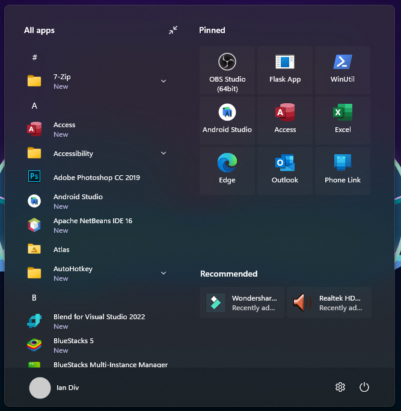

# Windows11_Metro10 theme for Windows 11 Start Menu Styler

A simple theme inspired by the Windows 10 Metro Start menu.

**Author**: [Ian Div](https://github.com/iandiv)



## Installation

The easiest way to install this theme is to import its styles. To do that,
follow these steps:

* Open the Windows 11 Start Menu Styler mod in Windhawk.
* Go to the "Advanced" tab.
* Copy the content below to the text box under "Mod settings" and click "Save".

<details>
<summary>Content to import (click to expand)</summary>

```json
{
  "controlStyles[0].target": "Windows.UI.Xaml.Controls.Grid#UndockedRoot",
  "controlStyles[0].styles[0]": "Visibility=Visible",
  "controlStyles[0].styles[1]": "MaxWidth=600",
  "controlStyles[0].styles[2]": "Margin=290,-10,0,0",
  "controlStyles[1].target": "Windows.UI.Xaml.Controls.Grid#AllAppsRoot",
  "controlStyles[1].styles[0]": "Visibility=Visible",
  "controlStyles[1].styles[1]": "Width=360",
  "controlStyles[1].styles[2]": "Transform3D:=<CompositeTransform3D TranslateX=\"-1059\" />",
  "controlStyles[2].target": "Windows.UI.Xaml.Controls.Button#CloseAllAppsButton",
  "controlStyles[2].styles[0]": "Visibility=Collapsed",
  "controlStyles[3].target": "StartDocked.StartSizingFrame",
  "controlStyles[3].styles[0]": "MinWidth=650",
  "controlStyles[3].styles[1]": "MaxWidth=650",
  "controlStyles[4].target": "Windows.UI.Xaml.Controls.Grid#ShowMoreSuggestions",
  "controlStyles[4].styles[0]": "Visibility=Collapsed",
  "controlStyles[5].target": "Windows.UI.Xaml.Controls.Button#ShowAllAppsButton",
  "controlStyles[5].styles[0]": "Visibility=Collapsed",
  "controlStyles[6].target": "Windows.UI.Xaml.Controls.GridView#RecommendedList > Windows.UI.Xaml.Controls.Border > Windows.UI.Xaml.Controls.ScrollViewer#ScrollViewer > Windows.UI.Xaml.Controls.Border#Root > Windows.UI.Xaml.Controls.Grid > Windows.UI.Xaml.Controls.ScrollContentPresenter#ScrollContentPresenter > Windows.UI.Xaml.Controls.ItemsPresenter > Windows.UI.Xaml.Controls.ItemsWrapGrid > Windows.UI.Xaml.Controls.GridViewItem",
  "controlStyles[6].styles[0]": "MaxWidth=145",
  "controlStyles[6].styles[1]": "MinWidth=145",
  "controlStyles[7].target": "StartDocked.AllAppsGridListView#AppsList",
  "controlStyles[7].styles[0]": "Padding=90,3,6,16",
  "controlStyles[8].target": "Windows.UI.Xaml.Controls.Grid#AllAppsPaneHeader",
  "controlStyles[8].styles[0]": "Margin=97,-10,0,0",
  "controlStyles[9].target": "Windows.UI.Xaml.Controls.Grid#SuggestionsParentContainer",
  "controlStyles[9].styles[0]": "Height=168",
  "controlStyles[10].target": "StartDocked.NavigationPaneView#NavigationPane",
  "controlStyles[10].styles[0]": "FlowDirection=0",
  "controlStyles[10].styles[1]": "Margin=30,0,30,0",
  "controlStyles[11].target": "StartDocked.PowerOptionsView#PowerButton",
  "controlStyles[11].styles[0]": "FlowDirection=0",
  "controlStyles[12].target": "StartDocked.AppListView#NavigationPanePlacesListView",
  "controlStyles[12].styles[0]": "FlowDirection=1",
  "controlStyles[13].target": "Windows.UI.Xaml.Controls.ListViewItem",
  "controlStyles[13].styles[0]": "FlowDirection=0",
  "controlStyles[14].target": "Windows.UI.Xaml.Controls.ItemsStackPanel > Windows.UI.Xaml.Controls.ListViewItem",
  "controlStyles[14].styles[0]": "FlowDirection=0",
  "controlStyles[15].target": "StartDocked.SearchBoxToggleButton#StartMenuSearchBox",
  "controlStyles[15].styles[0]": "Margin=23,-101,23,14",
  "controlStyles[16].target": "Windows.UI.Xaml.Controls.TextBlock#NoSuggestionsWithoutSettingsLink",
  "controlStyles[16].styles[0]": "Margin=11,0,48,0",
  "theme": "",
  "controlStyles[17].target": "StartDocked.LauncherFrame > Windows.UI.Xaml.Controls.Grid#RootGrid > Windows.UI.Xaml.Controls.Grid#RootContent > Windows.UI.Xaml.Controls.Grid#MainContent > Windows.UI.Xaml.Controls.Grid#InnerContent > Windows.UI.Xaml.Shapes.Rectangle",
  "controlStyles[17].styles[0]": "Margin=67,7,0,21",
  "controlStyles[18].target": "Windows.UI.Xaml.Controls.SemanticZoom#ZoomControl",
  "controlStyles[18].styles[0]": "IsZoomOutButtonEnabled=true",
  "controlStyles[19].target": "Windows.UI.Xaml.Controls.Button#ZoomOutButton > Windows.UI.Xaml.Controls.ContentPresenter#ContentPresenter > Windows.UI.Xaml.Controls.TextBlock",
  "controlStyles[19].styles[0]": "Text=",
  "controlStyles[20].target": "Windows.UI.Xaml.Controls.Button#ZoomOutButton",
  "controlStyles[20].styles[0]": "Width=28",
  "controlStyles[20].styles[1]": "Height=28",
  "controlStyles[20].styles[2]": "Margin=-1,-36,0,0",
  "controlStyles[20].styles[3]": "FontSize=14",
  "controlStyles[20].styles[4]": "CornerRadius=4",
  "controlStyles[21].target": "Windows.UI.Xaml.Controls.ListView#ZoomAppsList",
  "controlStyles[21].styles[0]": "Padding=86,0,27,0",
  "controlStyles[20].styles[5]": "VerticalAlignment=0",
  "controlStyles[20].styles[6]": "Background=Transparent",
  "controlStyles[20].styles[7]": "BorderBrush=Transparent",
  "controlStyles[1].styles[3]": "Margin=180,0,-220,0",
  "controlStyles[22].target": "StartDocked.SearchBoxToggleButton",
  "controlStyles[22].styles[0]": "Height=0",
  "controlStyles[22].styles[1]": "Margin=0,-100,0,24",
  "controlStyles[3].styles[2]": "MaxHeight=670",
  "controlStyles[23].target": "StartMenu.PinnedList",
  "controlStyles[23].styles[0]": "MaxHeight=400",
  "controlStyles[24].target": "Windows.UI.Xaml.Controls.TextBlock#PinnedListHeaderText",
  "controlStyles[24].styles[0]": "Margin=-30,0,0,0",
  "controlStyles[25].target": "Windows.UI.Xaml.Controls.Grid#SuggestionsParentContainer",
  "controlStyles[25].styles[0]": "Margin=-20,0,0,0",
  "controlStyles[26].target": "Windows.UI.Xaml.Controls.Grid#TopLevelSuggestionsListHeader",
  "controlStyles[26].styles[0]": "Margin=35,0,0,0",
  "controlStyles[27].target": "Windows.UI.Xaml.Controls.Border#ContentBorder > Windows.UI.Xaml.Controls.Grid#DroppedFlickerWorkaroundWrapper > Border@CommonStates",
  "controlStyles[27].styles[0]": "BorderBrush@Active:=<RevealBorderBrush Color=\"White\" TargetTheme=\"1\" Opacity=\"0.3\"/>",
  "controlStyles[27].styles[1]": "Background:=<RevealBorderBrush Color=\"Transparent\" TargetTheme=\"1\" Opacity=\"0.3\"/>\t",
  "controlStyles[27].styles[2]": "Margin=1",
  "controlStyles[27].styles[3]": "BorderBrush:=<RevealBorderBrush Color=\"Transparent\" TargetTheme=\"1\" Opacity=\"0.8\"/>",
  "controlStyles[28].target": "Windows.UI.Xaml.Controls.Border#ContentBorder > Windows.UI.Xaml.Controls.Grid#DroppedFlickerWorkaroundWrapper > Border#BackgroundBorder",
  "controlStyles[28].styles[0]": "Background:=<RevealBorderBrush Color=\"#646464\" TargetTheme=\"1\" Opacity=\".1\"/>\t",
  "controlStyles[28].styles[1]": "Margin=2",
  "controlStyles[29].target": "Windows.UI.Xaml.Controls.TextBlock#PinnedListHeaderText",
  "controlStyles[29].styles[0]": "Visibility=Visible",
  "controlStyles[6].styles[2]": "Margin=0",
  "controlStyles[30].target": "Rectangle[4]",
  "controlStyles[30].styles[0]": "Margin=0,-20,0,0",
  "controlStyles[18].styles[1]": "Margin=0",
  "controlStyles[31].target": "GridView#RecommendedList",
  "controlStyles[31].styles[0]": "Margin=-20,0,20,0"
}
```
</details>
