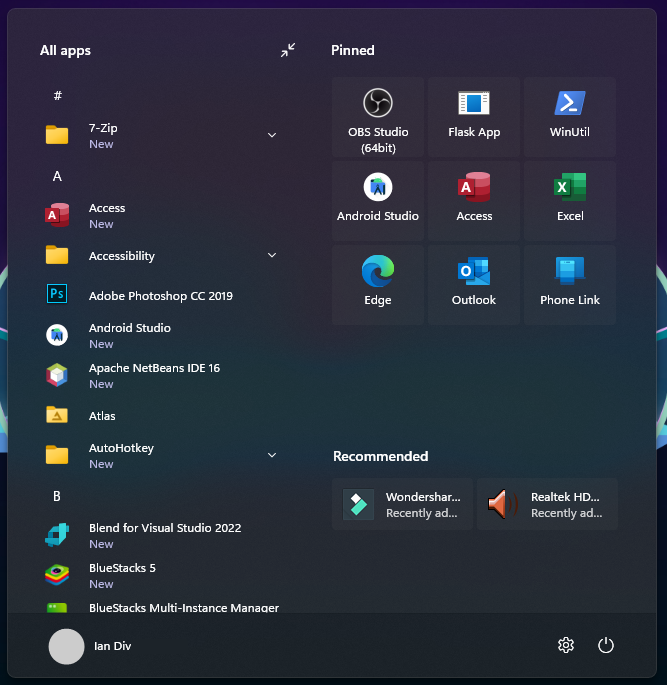

# Windows11_Metro10 theme for Windows 11 Start Menu Styler

A simple theme inspired by the Windows 10 Metro Start menu.

**Author**: [Ian Div](https://github.com/iandiv)



## Theme selection

The theme is integrated into the mod and can be selected directly from the mod's
settings:

* Open the Windows 11 Start Menu Styler mod in Windhawk.
* Go to the "Settings" tab.
* Select the theme and save the settings.

## Manual installation

The theme styles can also be imported manually. To do that, follow these steps:

* Open the Windows 11 Start Menu Styler mod in Windhawk.
* Go to the "Settings" tab and select "Textual mode".
* Copy the content below to the text box and click "Save settings".

### Redesigned Start menu

A variant for the [redesigned Windows 11 Start
menu](https://microsoft.design/articles/start-fresh-redesigning-windows-start-menu/)
that is slowly rolling out in the 25H2 update.

<details>
<summary>Content to import (click to expand)</summary>

```yaml
controlStyles:
  - target: GridView#AllAppsGrid > Border > ScrollViewer > Border > Grid > ScrollContentPresenter > ItemsPresenter > ItemsWrapGrid
    styles:
      - Visibility=Visible
      - Width=300
      - Margin=-150,-600,150,0
  - target: Windows.UI.Xaml.Controls.Button#CloseAllAppsButton
    styles:
      - Visibility=Collapsed
  - target: Grid#MainMenu
    styles:
      - MaxWidth=650
  - target: Windows.UI.Xaml.Controls.Grid#ShowMoreSuggestions
    styles:
      - Visibility=Collapsed
  - target: Grid#TopLevelHeader > Grid[2]
    styles:
      - Visibility=Collapsed
  - target: Windows.UI.Xaml.Controls.GridView#RecommendedList > Windows.UI.Xaml.Controls.Border > Windows.UI.Xaml.Controls.ScrollViewer#ScrollViewer > Windows.UI.Xaml.Controls.Border#Root > Windows.UI.Xaml.Controls.Grid > Windows.UI.Xaml.Controls.ScrollContentPresenter#ScrollContentPresenter > Windows.UI.Xaml.Controls.ItemsPresenter > Windows.UI.Xaml.Controls.ItemsWrapGrid > Windows.UI.Xaml.Controls.GridViewItem
    styles:
      - MaxWidth=145
      - MinWidth=145
      - Margin=0
  - target: Windows.UI.Xaml.Controls.Grid#AllAppsPaneHeader
    styles:
      - Margin=97,-10,0,0
  - target: Windows.UI.Xaml.Controls.Grid#SuggestionsParentContainer
    styles:
      - Height=168
  - target: StartDocked.NavigationPaneView#NavigationPane
    styles:
      - FlowDirection=0
      - Margin=30,0,30,0
  - target: StartDocked.PowerOptionsView#PowerButton
    styles:
      - FlowDirection=0
  - target: StartDocked.AppListView#NavigationPanePlacesListView
    styles:
      - FlowDirection=1
  - target: Windows.UI.Xaml.Controls.ListViewItem
    styles:
      - FlowDirection=0
  - target: Windows.UI.Xaml.Controls.Frame
    styles:
      - Margin=0,-65,0,0
  - target: StartMenu.SearchBoxToggleButton#StartMenuSearchBox
    styles:
      - Margin=23,-101,23,14
  - target: Windows.UI.Xaml.Controls.TextBlock#NoSuggestionsWithoutSettingsLink
    styles:
      - Margin=11,0,48,0
  - target: Windows.UI.Xaml.Controls.ListView#ZoomAppsList
    styles:
      - Padding=86,0,27,0
  - target: StartMenu.SearchBoxToggleButton
    styles:
      - Height=0
  - target: Windows.UI.Xaml.Controls.TextBlock#PinnedListHeaderText
    styles:
      - Margin=-30,-2,0,0
  - target: Windows.UI.Xaml.Controls.Grid#TopLevelSuggestionsListHeader
    styles:
      - Margin=35,0,0,0
  - target: Windows.UI.Xaml.Controls.GridViewItem > Windows.UI.Xaml.Controls.Border#ContentBorder@CommonStates > Windows.UI.Xaml.Controls.Grid#DroppedFlickerWorkaroundWrapper > Border
    styles:
      - BorderBrush@PointerOver:=<RevealBorderBrush Color="White" TargetTheme="1" Opacity="0.2"/>
      - Background@PointerOver:=<RevealBorderBrush Color="Transparent" TargetTheme="1" Opacity="0.3"/>
      - Margin=1
      - BorderBrush:=<RevealBorderBrush Color="Transparent" TargetTheme="1" Opacity="0.1"/>
  - target: GridView#PinnedList > Border > ScrollViewer > Border > Grid > Windows.UI.Xaml.Controls.ScrollContentPresenter > ItemsPresenter > ItemsWrapGrid > Windows.UI.Xaml.Controls.GridViewItem > Windows.UI.Xaml.Controls.Border#ContentBorder@CommonStates > Windows.UI.Xaml.Controls.Grid#DroppedFlickerWorkaroundWrapper > Border
    styles:
      - Background:=<RevealBorderBrush Color="#646464" TargetTheme="1" Opacity=".1"/>
      - Margin=2
      - CornerRadius=5
      - BorderBrush:=<RevealBorderBrush Color="Transparent" TargetTheme="1" Opacity="0.7"/>
      - BorderThickness=1
  - target: Windows.UI.Xaml.Controls.TextBlock#PinnedListHeaderText
    styles:
      - Visibility=Visible
      - Margin=40,-10,0,12
  - target: GridView#RecommendedList
    styles:
      - Margin=290,-58,-290,58
      - Width=290
  - target: StartMenu.ExpandedFolderList > Grid > Grid
    styles:
      - Margin=0,0,80,0
  - target: StartMenu.ExpandedFolderList > Grid > Border
    styles:
      - Width=350
      - Margin=0,0,92,0
  - target: StartMenu.ExpandedFolderList > Grid > Grid > Microsoft.UI.Xaml.Controls.PipsPager#PinnedListPipsPager
    styles:
      - Margin=-20,0,20,0
  - target: Border#AcrylicOverlay
    styles:
      - Margin=0,-70,0,0
  - target: GridView#PinnedList
    styles:
      - Margin=165,0,-165,0
      - Width=300
  - target: Grid#AllListHeading
    styles:
      - RenderTransform:=<TranslateTransform X="-334" Y="-604"/>
  - target: Grid#TopLevelSuggestionsListHeader
    styles:
      - RenderTransform:=<TranslateTransform X="252" Y="-58" />
  - target: Grid#TopLevelHeader > Grid > TextBlock
    styles:
      - RenderTransform:=<TranslateTransform X="305" Y="6" />
  - target: Grid#FrameRoot
    styles:
      - MaxHeight=670
  - target: TextBlock#AllListHeadingText
    styles:
      - Margin=65,1,0,0
  - target: Windows.UI.Xaml.Controls.ItemsWrapGrid
    styles:
      - MaximumRowsOrColumns=3
      - Grid.Row=1
  - target: StartMenu.PinnedList
    styles:
      - MaxHeight=420
      - MinHeight=420
      - Height=420
      - Margin=0,-32,0,32
  - target: GridView#PinnedList > Border > Windows.UI.Xaml.Controls.ScrollViewer
    styles:
      - ScrollViewer.VerticalScrollMode=2
      - Height=336
  - target: GridView#RecommendedList > Border > Windows.UI.Xaml.Controls.ScrollViewer
    styles:
      - ScrollViewer.VerticalScrollMode=2
      - Height=120
  - target: Button#Header > Border#Border@CommonStates
    styles:
      - Background@PointerOver:=<RevealBorderBrush Color="Transparent" TargetTheme="1" Opacity="0.3"/>
      - BorderBrush:=<RevealBorderBrush Color="Transparent" TargetTheme="1" Opacity="0.3"/>
      - BorderThickness=1
  - target: Windows.UI.Xaml.Controls.ListViewItem > Grid#ContentBorder@CommonStates
    styles:
      - Background@PointerOver:=<RevealBorderBrush Color="Transparent" TargetTheme="1" Opacity="0.3"/>
      - BorderBrush:=<RevealBorderBrush Color="Transparent" TargetTheme="1" Opacity="0.3"/>
      - BorderBrush@PointerOver:=<RevealBorderBrush Color="Transparent" TargetTheme="1" Opacity="0.7"/>
      - BorderThickness=1
      - CornerRadius=5
  - target: Windows.UI.Xaml.Controls.Border#ContentBorder > Windows.UI.Xaml.Controls.Grid#DroppedFlickerWorkaroundWrapper > Border#HighContrastBorder
    styles:
      - Background:=<RevealBorderBrush Color="Transparent" TargetTheme="1" Opacity="0.3"/>
      - BorderBrush:=<RevealBorderBrush Color="Transparent" TargetTheme="1" Opacity="0.7"/>
      - BorderThickness=1
  - target: StartMenu.CategoryControl > Grid > Border
    styles:
      - Height=132
      - Width=132
  - target: StartMenu.CategoryControl
    styles:
      - Margin=-22,-16,-22,0
      - Width=165
  - target: Button#SeeAllButton
    styles:
      - Width=132
      - Margin=0,-4,0,4
  - target: Button#SeeAllButton > Grid@CommonStates
    styles:
      - Background@PointerOver:=<RevealBorderBrush Color="Transparent" TargetTheme="1" Opacity="1"/>
      - BorderBrush@PointerOver:=<RevealBorderBrush Color="Transparent" TargetTheme="1" Opacity="1"/>
      - CornerRadius=5
      - BorderThickness=1
  - target: Button#LogoContainer > Grid@CommonStates > Border
    styles:
      - Width=57
      - Height=57
      - Background@PointerOver:=<RevealBorderBrush Color="Transparent" TargetTheme="1" Opacity="1"/>
      - BorderBrush@PointerOver:=<RevealBorderBrush Color="Transparent" TargetTheme="1" Opacity="1"/>
  - target: Button#LogoContainer
    styles:
      - Margin=5,-1,-5,0
  - target: Button#FolderPlate > Grid@CommonStates > Border
    styles:
      - Width=57
      - Height=57
      - Background@PointerOver:=<RevealBorderBrush Color="Transparent" TargetTheme="1" Opacity="1"/>
      - BorderBrush@PointerOver:=<RevealBorderBrush Color="Transparent" TargetTheme="1" Opacity="1"/>
  - target: Button#FolderPlate
    styles:
      - Margin=4,-1,-4,0
  - target: Grid#MainMenu > Grid#MainContent > Grid
    styles:
      - Canvas.ZIndex=1
  - target: Grid#TopLevelSuggestionsRoot
    styles:
      - MinHeight=129
```
</details>

### Classic Start menu

<details>
<summary>Content to import (click to expand)</summary>

```yaml
controlStyles:
  - target: Windows.UI.Xaml.Controls.Grid#UndockedRoot
    styles:
      - Visibility=Visible
      - MaxWidth=600
      - Margin=290,-10,0,0
  - target: Windows.UI.Xaml.Controls.Grid#AllAppsRoot
    styles:
      - Visibility=Visible
      - Width=360
      - Transform3D:=<CompositeTransform3D TranslateX="-1059" />
      - Margin=180,0,-220,0
  - target: Windows.UI.Xaml.Controls.Button#CloseAllAppsButton
    styles:
      - Visibility=Collapsed
  - target: StartDocked.StartSizingFrame
    styles:
      - MinWidth=650
      - MaxWidth=650
      - MaxHeight=670
  - target: Windows.UI.Xaml.Controls.Grid#ShowMoreSuggestions
    styles:
      - Visibility=Collapsed
  - target: Windows.UI.Xaml.Controls.Button#ShowAllAppsButton
    styles:
      - Visibility=Collapsed
  - target: Windows.UI.Xaml.Controls.GridView#RecommendedList > Windows.UI.Xaml.Controls.Border > Windows.UI.Xaml.Controls.ScrollViewer#ScrollViewer > Windows.UI.Xaml.Controls.Border#Root > Windows.UI.Xaml.Controls.Grid > Windows.UI.Xaml.Controls.ScrollContentPresenter#ScrollContentPresenter > Windows.UI.Xaml.Controls.ItemsPresenter > Windows.UI.Xaml.Controls.ItemsWrapGrid > Windows.UI.Xaml.Controls.GridViewItem
    styles:
      - MaxWidth=145
      - MinWidth=145
      - Margin=0
  - target: StartDocked.AllAppsGridListView#AppsList
    styles:
      - Padding=90,3,6,16
  - target: Windows.UI.Xaml.Controls.Grid#AllAppsPaneHeader
    styles:
      - Margin=97,-10,0,0
  - target: Windows.UI.Xaml.Controls.Grid#SuggestionsParentContainer
    styles:
      - Height=168
  - target: StartDocked.NavigationPaneView#NavigationPane
    styles:
      - FlowDirection=0
      - Margin=30,0,30,0
  - target: StartDocked.PowerOptionsView#PowerButton
    styles:
      - FlowDirection=0
  - target: StartDocked.AppListView#NavigationPanePlacesListView
    styles:
      - FlowDirection=1
  - target: Windows.UI.Xaml.Controls.ListViewItem
    styles:
      - FlowDirection=0
  - target: Windows.UI.Xaml.Controls.ItemsStackPanel > Windows.UI.Xaml.Controls.ListViewItem
    styles:
      - FlowDirection=0
  - target: StartDocked.SearchBoxToggleButton#StartMenuSearchBox
    styles:
      - Margin=23,-101,23,14
  - target: Windows.UI.Xaml.Controls.TextBlock#NoSuggestionsWithoutSettingsLink
    styles:
      - Margin=11,0,48,0
  - target: StartDocked.LauncherFrame > Windows.UI.Xaml.Controls.Grid#RootGrid > Windows.UI.Xaml.Controls.Grid#RootContent > Windows.UI.Xaml.Controls.Grid#MainContent > Windows.UI.Xaml.Controls.Grid#InnerContent > Windows.UI.Xaml.Shapes.Rectangle
    styles:
      - Margin=67,7,0,21
  - target: Windows.UI.Xaml.Controls.SemanticZoom#ZoomControl
    styles:
      - IsZoomOutButtonEnabled=true
      - Margin=0
  - target: Windows.UI.Xaml.Controls.Button#ZoomOutButton > Windows.UI.Xaml.Controls.ContentPresenter#ContentPresenter > Windows.UI.Xaml.Controls.TextBlock
    styles:
      - Text=
  - target: Windows.UI.Xaml.Controls.Button#ZoomOutButton
    styles:
      - Width=28
      - Height=28
      - Margin=-1,-36,0,0
      - FontSize=14
      - CornerRadius=4
      - VerticalAlignment=0
      - Background=Transparent
      - BorderBrush=Transparent
  - target: Windows.UI.Xaml.Controls.ListView#ZoomAppsList
    styles:
      - Padding=86,0,27,0
  - target: StartDocked.SearchBoxToggleButton
    styles:
      - Height=0
      - Margin=0,-100,0,24
  - target: StartMenu.PinnedList
    styles:
      - MaxHeight=400
  - target: Windows.UI.Xaml.Controls.TextBlock#PinnedListHeaderText
    styles:
      - Margin=-30,-2,0,0
  - target: Windows.UI.Xaml.Controls.Grid#SuggestionsParentContainer
    styles:
      - Margin=-20,0,0,0
  - target: Windows.UI.Xaml.Controls.Grid#TopLevelSuggestionsListHeader
    styles:
      - Margin=35,0,0,0
  - target: Windows.UI.Xaml.Controls.Border#ContentBorder > Windows.UI.Xaml.Controls.Grid#DroppedFlickerWorkaroundWrapper > Border@CommonStates
    styles:
      - BorderBrush@Active:=<RevealBorderBrush Color="White" TargetTheme="1" Opacity="0.3"/>
      - Background:=<RevealBorderBrush Color="Transparent" TargetTheme="1" Opacity="0.3"/>
      - Margin=1
      - BorderBrush:=<RevealBorderBrush Color="Transparent" TargetTheme="1" Opacity="0.8"/>
  - target: Windows.UI.Xaml.Controls.Border#ContentBorder > Windows.UI.Xaml.Controls.Grid#DroppedFlickerWorkaroundWrapper > Border#BackgroundBorder
    styles:
      - Background:=<RevealBorderBrush Color="#646464" TargetTheme="1" Opacity=".1"/>
      - Margin=2
  - target: Windows.UI.Xaml.Controls.TextBlock#PinnedListHeaderText
    styles:
      - Visibility=Visible
  - target: Rectangle[4]
    styles:
      - Margin=0,-20,0,0
  - target: GridView#RecommendedList
    styles:
      - Margin=-20,0,20,0
  - target: StartMenu.ExpandedFolderList > Grid > Grid
    styles:
      - Margin=0,0,80,0
  - target: StartMenu.ExpandedFolderList > Grid > Border
    styles:
      - Width=350
      - Margin=0,0,92,0
  - target: Microsoft.UI.Xaml.Controls.PipsPager#PinnedListPipsPager
    styles:
      - Margin=-10,0,0,0
  - target: StartMenu.ExpandedFolderList > Grid > Grid > Microsoft.UI.Xaml.Controls.PipsPager#PinnedListPipsPager
    styles:
      - Margin=-20,0,20,0
```
</details>
