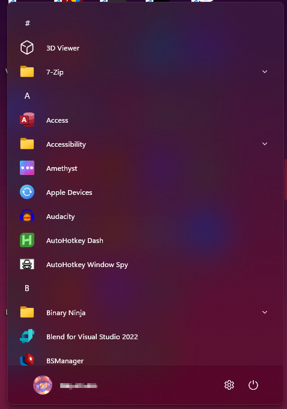

# Windows11_Metro10Minimal theme for Windows 11 Start Menu Styler

A minimalist version of Windows11_Metro10.

**Author**: [Y2K4](https://github.com/y2k04)

**Author of base theme**: [Ian Div](https://github.com/iandiv)



## Theme selection

The theme is integrated into the mod and can simply be selected from the mod's
settings:

* Open the Windows 11 Start Menu Styler mod in Windhawk.
* Go to the "Settings" tab.
* Select the theme and save the settings.

## Manual installation

The theme styles can also be imported manually. To do that, follow these steps:

* Open the Windows 11 Start Menu Styler mod in Windhawk.
* Go to the "Advanced" tab.
* Copy the content below to the text box under "Mod settings" and click "Save".

### Redesigned Start menu

A variant for the [redesigned Windows 11 Start
menu](https://microsoft.design/articles/start-fresh-redesigning-windows-start-menu/)
that is slowly rolling out in the 25H2 update.

<details>
<summary>Content to import (click to expand)</summary>

```json
{
  "controlStyles[0].target": "Grid#MainMenu",
  "controlStyles[0].styles[0]": "Visibility=Visible",
  "controlStyles[0].styles[1]": "Width=420",
  "controlStyles[0].styles[2]": "Background=Transparent",
  "controlStyles[0].styles[3]": "CornerRadius=8",
  "controlStyles[1].target": "Grid#FrameRoot",
  "controlStyles[1].styles[0]": "MaxHeight=670",
  "controlStyles[2].target": "GridView#AllAppsGrid",
  "controlStyles[2].styles[0]": "Visibility=Visible",
  "controlStyles[2].styles[1]": "Margin=0,-32,0,1",
  "controlStyles[3].target": "StartDocked.NavigationPaneView",
  "controlStyles[3].styles[0]": "Margin=-30,0,-30,0",
  "controlStyles[4].target": "StartDocked.AppListView#NavigationPanePlacesListView",
  "controlStyles[4].styles[0]": "FlowDirection=1",
  "controlStyles[5].target": "StartMenu.SearchBoxToggleButton",
  "controlStyles[5].styles[0]": "Visibility=Collapsed",
  "controlStyles[6].target": "StartMenu.ExpandedFolderList > Grid > Grid > Microsoft.UI.Xaml.Controls.PipsPager#PinnedListPipsPager",
  "controlStyles[6].styles[0]": "Margin=-20,0,20,0",
  "controlStyles[7].target": "Border#AcrylicBorder",
  "controlStyles[7].styles[0]": "BorderBrush:=<AcrylicBrush TintColor=\"{ThemeResource SurfaceStrokeColorDefault}\" FallbackColor=\"{ThemeResource SurfaceStrokeColorDefault}\" TintOpacity=\"0\" TintLuminosityOpacity=\".25\" Opacity=\"1\"/>",
  "controlStyles[7].styles[1]": "BorderThickness=1",
  "controlStyles[8].target": "Border#AppBorder",
  "controlStyles[8].styles[0]": "Background:=<AcrylicBrush TintColor=\"{ThemeResource CardStrokeColorDefaultSolid}\" FallbackColor=\"{ThemeResource CardStrokeColorDefaultSolid}\" TintOpacity=\"0\" TintLuminosityOpacity=\".85\" Opacity=\"1\"/>",
  "controlStyles[8].styles[1]": "BorderBrush:=<AcrylicBrush TintColor=\"{ThemeResource SurfaceStrokeColorDefault}\" FallbackColor=\"{ThemeResource SurfaceStrokeColorDefault}\" TintOpacity=\"0\" TintLuminosityOpacity=\".25\" Opacity=\"1\"/>",
  "controlStyles[9].target": "Border#LayerBorder",
  "controlStyles[9].styles[0]": "Visibility=1",
  "controlStyles[10].target": "Windows.UI.Xaml.Controls.Grid#TopLevelSuggestionsListHeader",
  "controlStyles[10].styles[0]": "Visibility=Collapsed",
  "controlStyles[11].target": "Windows.UI.Xaml.Controls.Frame",
  "controlStyles[11].styles[0]": "Margin=0,-65,0,0",
  "controlStyles[12].target": "Border#AcrylicOverlay",
  "controlStyles[12].styles[0]": "Margin=0,-70,0,0",
  "controlStyles[13].target": "Windows.UI.Xaml.Controls.ItemsWrapGrid",
  "controlStyles[13].styles[0]": "Margin=12,0,12,0",
  "controlStyles[14].target": "StartMenu.FolderModal > Grid > Border",
  "controlStyles[14].styles[0]": "Width=350",
  "controlStyles[15].target": "StartMenu.PinnedList",
  "controlStyles[15].styles[0]": "Visibility=Collapsed",
  "controlStyles[14].styles[1]": "Margin=-20,0,20,0",
  "controlStyles[16].target": "Windows.UI.Xaml.Controls.GridView#LevelOneGridView",
  "controlStyles[16].styles[0]": "Margin=16,0,-16,0",
  "controlStyles[17].target": "GridView#RecommendedList",
  "controlStyles[17].styles[0]": "Visibility=Collapsed",
  "controlStyles[18].target": "Windows.UI.Xaml.Controls.Grid#NoTopLevelSuggestionsText",
  "controlStyles[18].styles[0]": "Visibility=Collapsed",
  "controlStyles[19].target": "Grid#TopLevelSuggestionsRoot > Grid[2]",
  "controlStyles[19].styles[0]": "MinHeight=0",
  "controlStyles[20].target": "Grid#TopLevelSuggestionsRoot",
  "controlStyles[20].styles[0]": "Visibility=Collapsed",
  "controlStyles[21].target": "Grid#TopLevelHeader > Grid[2] > Button",
  "controlStyles[21].styles[0]": "Visibility=Collapsed",
  "controlStyles[22].target": "Windows.UI.Xaml.Controls.TextBlock#PinnedListHeaderText",
  "controlStyles[22].styles[0]": "Visibility=Collapsed",
  "controlStyles[23].target": "TextBlock[Text=All]",
  "controlStyles[23].styles[0]": "Visibility=Collapsed",
  "controlStyles[24].target": "Microsoft.UI.Xaml.Controls.DropDownButton",
  "controlStyles[24].styles[0]": "Grid.Column=0",
  "controlStyles[24].styles[1]": "RenderTransform:=<TranslateTransform X=\"12\" />",
  "controlStyles[25].target": "Windows.UI.Xaml.Controls.Primitives.ScrollBar",
  "controlStyles[25].styles[0]": "MaxHeight=570",
  "controlStyles[25].styles[1]": "Margin=0,15,0,-15",
  "controlStyles[26].target": "StartMenu.CategoryControl",
  "controlStyles[26].styles[0]": "Margin=-15,0-15,0",
  "controlStyles[26].styles[1]": "RenderTransform:=<TranslateTransform X=\"24\" />"
}
```
</details>

### Classic Start menu

<details>
<summary>Content to import (click to expand)</summary>

```json
{
  "controlStyles[0].target": "Windows.UI.Xaml.Controls.Grid#UndockedRoot",
  "controlStyles[0].styles[0]": "MaxWidth=0",
  "controlStyles[0].styles[1]": "Margin=0",
  "controlStyles[1].target": "Windows.UI.Xaml.Controls.Grid#AllAppsRoot",
  "controlStyles[1].styles[0]": "Visibility=Visible",
  "controlStyles[1].styles[1]": "Width=540",
  "controlStyles[1].styles[2]": "Margin=-1000,0,0,0",
  "controlStyles[2].target": "StartDocked.StartSizingFrame",
  "controlStyles[2].styles[0]": "MinWidth=460",
  "controlStyles[2].styles[1]": "MaxWidth=460",
  "controlStyles[2].styles[2]": "MaxHeight=670",
  "controlStyles[3].target": "Windows.UI.Xaml.Controls.Grid#ShowMoreSuggestions",
  "controlStyles[3].styles[0]": "Visibility=Collapsed",
  "controlStyles[4].target": "Windows.UI.Xaml.Controls.Button#ShowAllAppsButton",
  "controlStyles[4].styles[0]": "Visibility=Collapsed",
  "controlStyles[5].target": "StartDocked.AllAppsGridListView#AppsList",
  "controlStyles[5].styles[0]": "Padding=90,3,6,16",
  "controlStyles[6].target": "Grid#AllAppsPaneHeader",
  "controlStyles[6].styles[0]": "Visibility=Collapsed",
  "controlStyles[7].target": "StartDocked.NavigationPaneView#NavigationPane",
  "controlStyles[7].styles[0]": "Margin=30,0,30,0",
  "controlStyles[8].target": "StartDocked.AppListView#NavigationPanePlacesListView",
  "controlStyles[8].styles[0]": "FlowDirection=1",
  "controlStyles[9].target": "StartDocked.SearchBoxToggleButton#StartMenuSearchBox",
  "controlStyles[9].styles[0]": "Margin=23,-101,23,14",
  "controlStyles[10].target": "StartDocked.SearchBoxToggleButton",
  "controlStyles[10].styles[0]": "Height=0",
  "controlStyles[11].target": "Rectangle[4]",
  "controlStyles[11].styles[0]": "Margin=0,-20,0,0",
  "controlStyles[12].target": "StartMenu.ExpandedFolderList > Grid > Grid > Microsoft.UI.Xaml.Controls.PipsPager#PinnedListPipsPager",
  "controlStyles[12].styles[0]": "Margin=-20,0,20,0",
  "controlStyles[13].target": "StartMenu.StartInnerFrame",
  "controlStyles[13].styles[0]": "Visibility=Collapsed",
  "controlStyles[14].target": "Grid#RootContent",
  "controlStyles[14].styles[0]": "MinWidth=460",
  "controlStyles[15].target": "Grid#InnerContent",
  "controlStyles[15].styles[0]": "Margin=0,12,0,0",
  "controlStyles[16].target": "Border#AcrylicBorder",
  "controlStyles[16].styles[0]": "Background:=<AcrylicBrush TintColor=\"{ThemeResource CardStrokeColorDefaultSolid}\" FallbackColor=\"{ThemeResource CardStrokeColorDefaultSolid}\" TintOpacity=\"0\" TintLuminosityOpacity=\".85\" Opacity=\"1\"/>",
  "controlStyles[16].styles[1]": "BorderBrush:=<AcrylicBrush TintColor=\"{ThemeResource SurfaceStrokeColorDefault}\" FallbackColor=\"{ThemeResource SurfaceStrokeColorDefault}\" TintOpacity=\"0\" TintLuminosityOpacity=\".25\" Opacity=\"1\"/>",
  "controlStyles[16].styles[2]": "BorderThickness=1",
  "controlStyles[17].target": "Border#AppBorder",
  "controlStyles[17].styles[0]": "Background:=<AcrylicBrush TintColor=\"{ThemeResource CardStrokeColorDefaultSolid}\" FallbackColor=\"{ThemeResource CardStrokeColorDefaultSolid}\" TintOpacity=\"0\" TintLuminosityOpacity=\".85\" Opacity=\"1\"/>",
  "controlStyles[17].styles[1]": "BorderBrush:=<AcrylicBrush TintColor=\"{ThemeResource SurfaceStrokeColorDefault}\" FallbackColor=\"{ThemeResource SurfaceStrokeColorDefault}\" TintOpacity=\"0\" TintLuminosityOpacity=\".25\" Opacity=\"1\"/>",
  "controlStyles[18].target": "Border#LayerBorder",
  "controlStyles[18].styles[0]": "Visibility=1"
}
```
</details>
