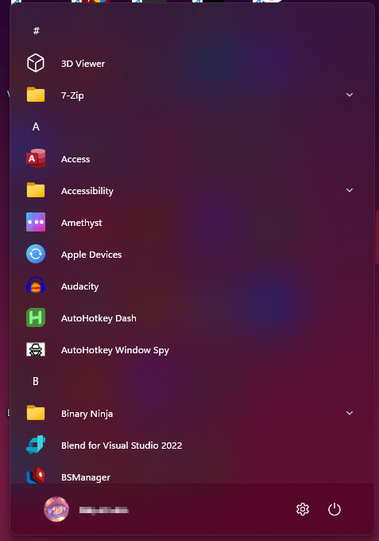

# Windows11_Metro10Minimal theme for Windows 11 Start Menu Styler

A minimalist version of Windows11_Metro10.

**Author**: [Y2K4](https://github.com/y2k04)

**Author of base theme**: [Ian Div](https://github.com/iandiv)



## Theme selection

The theme is integrated into the mod and can be selected directly from the mod's
settings:

* Open the Windows 11 Start Menu Styler mod in Windhawk.
* Go to the "Settings" tab.
* Select the theme and save the settings.

## Manual installation

The theme styles can also be imported manually. To do that, follow these steps:

* Open the Windows 11 Start Menu Styler mod in Windhawk.
* Go to the "Settings" tab and select "Textual mode".
* Copy the content below to the text box and click "Save settings".

### Redesigned Start menu

A variant for the [redesigned Windows 11 Start
menu](https://microsoft.design/articles/start-fresh-redesigning-windows-start-menu/)
that is slowly rolling out in the 25H2 update.

<details>
<summary>Content to import (click to expand)</summary>

```yaml
controlStyles:
  - target: Grid#MainMenu
    styles:
      - Visibility=Visible
      - Width=420
      - Background=Transparent
      - CornerRadius=8
  - target: Grid#FrameRoot
    styles:
      - MaxHeight=670
  - target: GridView#AllAppsGrid
    styles:
      - Visibility=Visible
      - Margin=0,-32,0,1
  - target: StartDocked.NavigationPaneView
    styles:
      - Margin=-30,0,-30,0
  - target: StartDocked.AppListView#NavigationPanePlacesListView
    styles:
      - FlowDirection=1
  - target: StartMenu.SearchBoxToggleButton
    styles:
      - Visibility=Collapsed
  - target: StartMenu.ExpandedFolderList > Grid > Grid > Microsoft.UI.Xaml.Controls.PipsPager#PinnedListPipsPager
    styles:
      - Margin=-20,0,20,0
  - target: Border#AcrylicBorder
    styles:
      - BorderBrush:=<AcrylicBrush TintColor="{ThemeResource SurfaceStrokeColorDefault}" FallbackColor="{ThemeResource SurfaceStrokeColorDefault}" TintOpacity="0" TintLuminosityOpacity=".25" Opacity="1"/>
      - BorderThickness=1
  - target: Border#AppBorder
    styles:
      - Background:=<AcrylicBrush TintColor="{ThemeResource CardStrokeColorDefaultSolid}" FallbackColor="{ThemeResource CardStrokeColorDefaultSolid}" TintOpacity="0" TintLuminosityOpacity=".85" Opacity="1"/>
      - BorderBrush:=<AcrylicBrush TintColor="{ThemeResource SurfaceStrokeColorDefault}" FallbackColor="{ThemeResource SurfaceStrokeColorDefault}" TintOpacity="0" TintLuminosityOpacity=".25" Opacity="1"/>
  - target: Border#LayerBorder
    styles:
      - Visibility=1
  - target: Windows.UI.Xaml.Controls.Grid#TopLevelSuggestionsListHeader
    styles:
      - Visibility=Collapsed
  - target: Windows.UI.Xaml.Controls.Frame
    styles:
      - Margin=0,-65,0,0
  - target: Border#AcrylicOverlay
    styles:
      - Margin=0,-70,0,0
  - target: Windows.UI.Xaml.Controls.ItemsWrapGrid
    styles:
      - Margin=12,0,12,0
  - target: StartMenu.FolderModal > Grid > Border
    styles:
      - Width=350
      - Margin=-20,0,20,0
  - target: StartMenu.PinnedList
    styles:
      - Visibility=Collapsed
  - target: Windows.UI.Xaml.Controls.GridView#LevelOneGridView
    styles:
      - Margin=16,0,-16,0
  - target: GridView#RecommendedList
    styles:
      - Visibility=Collapsed
  - target: Windows.UI.Xaml.Controls.Grid#NoTopLevelSuggestionsText
    styles:
      - Visibility=Collapsed
  - target: Grid#TopLevelSuggestionsRoot > Grid[2]
    styles:
      - MinHeight=0
  - target: Grid#TopLevelSuggestionsRoot
    styles:
      - Visibility=Collapsed
  - target: Grid#TopLevelHeader > Grid[2] > Button
    styles:
      - Visibility=Collapsed
  - target: Windows.UI.Xaml.Controls.TextBlock#PinnedListHeaderText
    styles:
      - Visibility=Collapsed
  - target: TextBlock[Text=All]
    styles:
      - Visibility=Collapsed
  - target: Microsoft.UI.Xaml.Controls.DropDownButton
    styles:
      - Grid.Column=0
      - RenderTransform:=<TranslateTransform X="12" />
  - target: Windows.UI.Xaml.Controls.Primitives.ScrollBar
    styles:
      - MaxHeight=570
      - Margin=0,15,0,-15
  - target: StartMenu.CategoryControl
    styles:
      - Margin=-15,0-15,0
      - RenderTransform:=<TranslateTransform X="24" />
  - target: Grid#MainMenu > Grid#MainContent > Grid
    styles:
      - Canvas.ZIndex=1
```
</details>

### Classic Start menu

<details>
<summary>Content to import (click to expand)</summary>

```yaml
theme: ''
disableNewStartMenuLayout: '1'
# disableNewStartMenuLayout: disableNewLayoutKeepPhoneLink
controlStyles:
  - target: Windows.UI.Xaml.Controls.Grid#UndockedRoot
    styles:
      - MaxWidth=0
      - Margin=0
  - target: Windows.UI.Xaml.Controls.Grid#AllAppsRoot
    styles:
      - Visibility=Visible
      - Width=540
      - Margin=-1000,0,0,0
  - target: Windows.UI.Xaml.Controls.Grid#ShowMoreSuggestions
    styles:
      - Visibility=Collapsed
  - target: Windows.UI.Xaml.Controls.Button#ShowAllAppsButton
    styles:
      - Visibility=Collapsed
  - target: StartDocked.AllAppsGridListView#AppsList
    styles:
      - Padding=90,3,6,16
  - target: Grid#AllAppsPaneHeader
    styles:
      - Visibility=Collapsed
  - target: StartDocked.NavigationPaneView#NavigationPane
    styles:
      - Margin=30,0,30,0
  - target: StartDocked.AppListView#NavigationPanePlacesListView
    styles:
      - FlowDirection=1
  - target: StartDocked.SearchBoxToggleButton#StartMenuSearchBox
    styles:
      - Margin=23,-101,23,14
  - target: StartDocked.SearchBoxToggleButton
    styles:
      - Height=0
  - target: Rectangle[4]
    styles:
      - Margin=0,-20,0,0
  - target: StartMenu.ExpandedFolderList > Grid > Grid > Microsoft.UI.Xaml.Controls.PipsPager#PinnedListPipsPager
    styles:
      - Margin=-20,0,20,0
  - target: StartMenu.StartInnerFrame
    styles:
      - Visibility=Collapsed
  - target: StartDocked.StartSizingFrame
    styles:
      - MinWidth=460
      - MaxWidth=460
      - MaxHeight=670
  - target: StartDocked.LauncherFrame > Grid#RootGrid > Grid#RootContent
    styles:
      - MinWidth=460
      - MaxWidth=460
  - target: StartDocked.LauncherFrame > Grid#RootPanel > Grid#RootGrid
    styles:
      - MinWidth=460
      - MaxWidth=460
  - target: StartDocked.LauncherFrame > Grid#RootPanel > Grid#RootGrid > Grid#RootContent
    styles:
      - MinWidth=460
      - MaxWidth=460
  - target: Grid#InnerContent
    styles:
      - Margin=0,12,0,0
  - target: Border#AcrylicBorder
    styles:
      - Background:=<AcrylicBrush TintColor="{ThemeResource CardStrokeColorDefaultSolid}" FallbackColor="{ThemeResource CardStrokeColorDefaultSolid}" TintOpacity="0" TintLuminosityOpacity=".85" Opacity="1"/>
      - BorderBrush:=<AcrylicBrush TintColor="{ThemeResource SurfaceStrokeColorDefault}" FallbackColor="{ThemeResource SurfaceStrokeColorDefault}" TintOpacity="0" TintLuminosityOpacity=".25" Opacity="1"/>
      - BorderThickness=1
  - target: Border#AppBorder
    styles:
      - Background:=<AcrylicBrush TintColor="{ThemeResource CardStrokeColorDefaultSolid}" FallbackColor="{ThemeResource CardStrokeColorDefaultSolid}" TintOpacity="0" TintLuminosityOpacity=".85" Opacity="1"/>
      - BorderBrush:=<AcrylicBrush TintColor="{ThemeResource SurfaceStrokeColorDefault}" FallbackColor="{ThemeResource SurfaceStrokeColorDefault}" TintOpacity="0" TintLuminosityOpacity=".25" Opacity="1"/>
  - target: Border#LayerBorder
    styles:
      - Visibility=1
```
</details>
